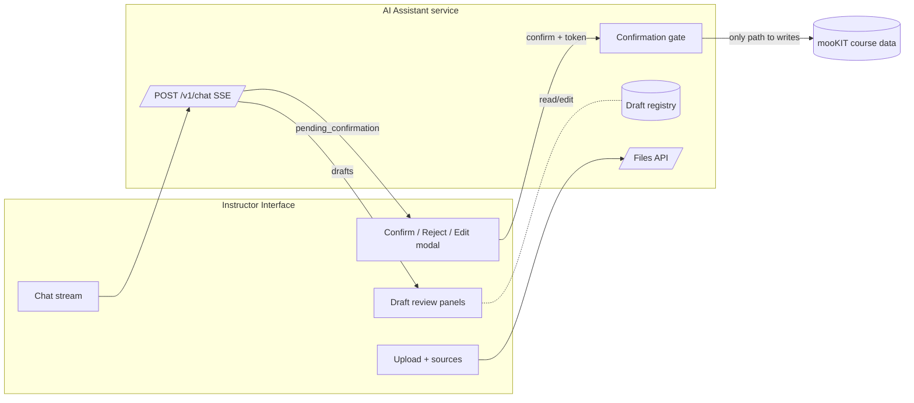
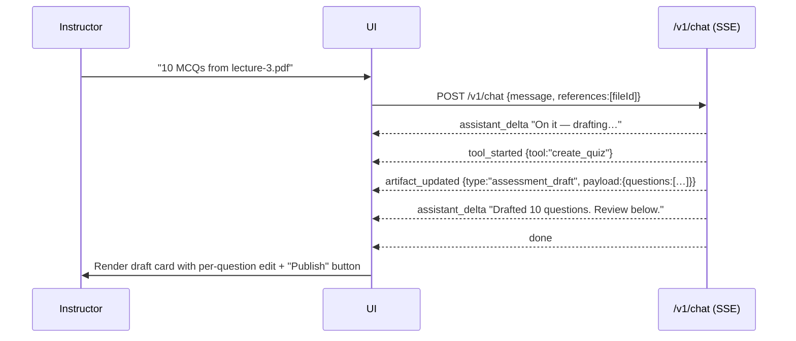
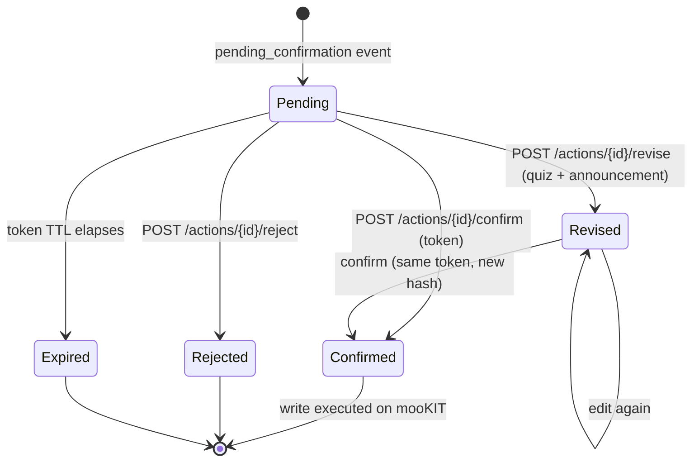
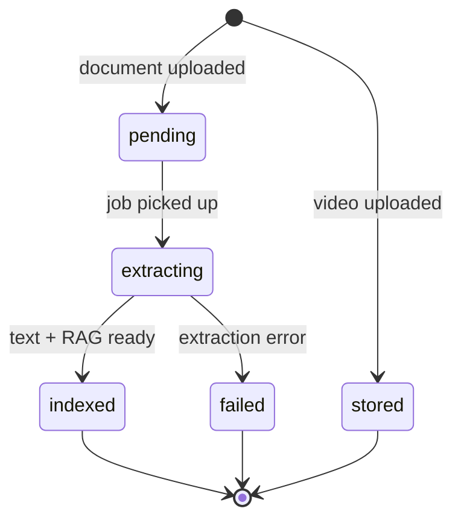

# mooKIT AI Assistant : UI Integration & Build Guide

**Scope:** everything needed to consume this service 

There is a working reference implementation in `sample-ui/index.html` — a single-file vanilla-JS demo that exercises nearly every endpoint here. It is a *demo*, not a design target. Treat it as the executable spec for "how the wire actually behaves."

---

## 1. Design Thought

 It is an **assistant that proposes, and a human that disposes.** Three concepts carry the entire product:

1. **The stream.** The instructor talks to the assistant over a single streaming endpoint (`POST /v1/chat`, SSE). Everything the assistant *does* arrives as typed events on that stream (text), "I'm calling a tool," "here's a draft," "please confirm this," "I need to ask you something."
2. **Artifacts (drafts).** The assistant never edits live course data while it works. It produces **drafts** : a quiz draft, an announcement draft, a lecture draft etc. , that live in this service. Drafts are versioned and editable. **Nothing in a draft is on mooKIT.**
3. **The confirmation gate.** The only way anything reaches the real course (publish a quiz, send an announcement, publish a lecture) is: the assistant emits a **pending confirmation**, the human(instructor) reviews an exact preview, and  explicitly confirms it with a one-time token. The model literally cannot publish. This is a hard security boundary.




---

## 2. UI and Auth

### 2.1  Assumption

The production UI is expected to run **embedded inside mooKIT** (the instructor is already logged into mooKIT. That means **the host environment supplies the identity**. 


| Value    |
| -------- |
| `course` |
| `token`  |
| `uid`    |


### 2.2 The header contract (every request)

Send these on **every** call to the service (chat, files, confirm, meta all of it):

```http
course: <course-id>
token:  <mookit-token>
uid:    <numeric-user-id>
```

Optional but recommended:


| Header          | Default                | Purpose                                                                                                                  |
| --------------- | ---------------------- | ------------------------------------------------------------------------------------------------------------------------ |
| `x-session-id`  | a new UUID per request | Conversation continuity. **Set this and keep it stable** for a conversation, otherwise each turn starts a fresh session. |
| `x-instance-id` | `"default"`            | Multi-tenant instance selector. Usually fixed per deployment.                                                            |
| `role`          | `"instructor"`         | Reserved; leave as instructor.                                                                                           |


The service derives a **tenant key** of `"{instanceId}:{course}"` internally, you never construct it, but it explains why every artifact, file, and session is scoped: nothing leaks across courses.

---

## 3. The chat stream

### 3.1 The request

```http
POST /v1/chat
Content-Type: application/json
course: …  token: …  uid: …  x-session-id: <stable-id>

{
  "message": "Make a 10-question quiz from the lecture-3 PDF",
  "sessionId": "conv-abc",          // optional; header x-session-id also works
  "instanceId": "default",          // optional
  "references": ["artifact-id-1"]   // optional; see @-mentions 
}
```

The response is `**text/event-stream**` (SSE). Open it with `EventSource` (if you can attach headers via your transport) or, more commonly given the custom headers, with `fetch` + a streaming body reader. The demo UI uses `fetch` + manual SSE parsing precisely because the auth headers can't ride on a native `EventSource`. 

### 3.2 The events

Every event is `event: <name>` + `data: <json>`. These are the eight event types, exhaustively:


| Event                  | When                                         | `data` shape                                                                                                                                 |
| ---------------------- | -------------------------------------------- | -------------------------------------------------------------------------------------------------------------------------------------------- |
| `assistant_delta`      | Streaming assistant prose                    | `{ text: string }` — append, don't replace                                                                                                   |
| `tool_started`         | Assistant began an action                    | `{ tool: string, label: string }`                                                                                                            |
| `tool_progress`        | Long-running action progress                 | `{ tool: string, pct: number, message: string }` *(emitted opportunistically; fast tools may skip it so don't depend on it for correctness)* |
| `artifact_updated`     | A draft was created or changed               | `{ artifact_id, type, version, preview?, payload? }`                                                                                         |
| `pending_confirmation` | A write needs human confirmation             | `{ action, action_id, confirm_token, target_ref, content_hash, preview, expires_at }`                                                        |
| `clarification`        | The assistant needs a decision from the user | `{ preamble?, questions: ClarificationQuestion[] }`                                                                                          |
| `error`                | Something failed                             | `{ code, message, retryable }`                                                                                                               |
| `done`                 | Turn finished                                | `{ response_id }`                                                                                                                            |


A turn **always** ends with exactly one terminal event: `done` (normal), or it stops after a `pending_confirmation`/`clarification` (both are followed by a `done`), or `error`. Your stream reader should treat `done` as "re-enable the composer."

### 3.3 TypeScript for the stream

```ts
type SseEvent =
  | { event: "assistant_delta";      data: { text: string } }
  | { event: "tool_started";         data: { tool: string; label: string } }
  | { event: "tool_progress";        data: { tool: string; pct: number; message: string } }
  | { event: "artifact_updated";     data: ArtifactUpdated }
  | { event: "pending_confirmation"; data: PendingConfirmation }
  | { event: "clarification";        data: ClarificationRequest }
  | { event: "error";                data: { code: string; message: string; retryable: boolean } }
  | { event: "done";                 data: { response_id: string } };

interface ArtifactUpdated {
  artifact_id: string;
  type: "assessment_draft" | "announcement_draft" | "lecture_draft" | "uploaded_file";
  version: number;
  preview?: PreviewRender;   // present for things that can be previewed
  payload?: DraftPayload;    // present when type ends with "_draft" — render this
}
```

### 3.4 Quiz




Key implementation notes from this path:

- When you get `artifact_updated` with a `_draft` payload, **render the draft inline in the conversation** (a rich card), not as a wall of JSON. The `payload` is everything you need .
- Keep a client-side map of `artifact_id → latest version/payload`. Subsequent `artifact_updated` events for the same id are edits, re-render in place.
- The assistant's closing prose (`assistant_delta`) and the draft card are complementary: prose explains, the card is the workspace.

### 3.5 Practical streaming concerns

- **Heartbeats:** the server sends SSE pings to keep proxies from killing idle connections. Your parser should ignore comment/ping frames.
- **Disconnects:** if the user navigates away, just drop the connection — the server detects client disconnect and aborts cleanly.
- **Rate limiting:** chat is rate-limited per tenant; you may get a `429` *before* the stream opens. Handle it as "you're going too fast," not a stream error.
- **One in-flight turn at a time:** disable the composer between send and `done`. The conversation model assumes turns are sequential.

---

## 4. The confirmation gate (Human in the loop)

### 4.1 The lifecycle




### 4.2 What you receive

When the assistant wants to write, you get a `pending_confirmation` event:

```ts
interface PendingConfirmation {
  action: "publish_assessment" | "send_announcement" | "publish_lecture";
  action_id: string;       // address this action
  confirm_token: string;   // one-time secret — required to confirm
  target_ref: Record<string, unknown>; // server-resolved target (ids), informational
  content_hash: string;    // binds the token to the exact payload
  preview: PreviewRender;  // render THIS — it is the faithful description of the write
  expires_at: string;      // ISO timestamp; after this, confirm will fail
}
```

The `preview` is the contract between the assistant and the human. **Render it faithfully and prominently** — it is deliberately a clean, human-readable summary of exactly what will happen:

```ts
interface PreviewRender {
  title: string;                 // "Publish quiz: Chapter 3 Quiz"
  summary_lines: string[];       // bullet summary of the change
  audience?: string;             // "142 students in CS101" (announcements/lectures)
  body_markdown?: string;        // rendered announcement/lecture body (already sanitized)
  diff?: { field: string; before: unknown; after: unknown }[]; // for updates
  warnings?: string[];           // "5 higher-order Bloom questions — review carefully"
}
```

Design guidance:

- Surface `title` as the modal header, `summary_lines` as the body, `warnings` in an unmissable callout (amber). For announcements/lectures, show `audience` and render `body_markdown`.
- Show a countdown or at least a relative "expires in N min" from `expires_at`. If it expires, the confirm call 404s — guide the user to ask the assistant again rather than showing a raw error.

### 4.3 The three actions

**Confirm** : the only path to a real write:

```http
POST /v1/actions/{action_id}/confirm
{ "confirm_token": "<from the event>" }
→ 200 { "success": true, "data": <mooKIT result> }
→ 404 if token invalid / already used / expired / payload hash changed
```

On success, the write has happened on mooKIT. Reflect it: mark the draft as published, disable the confirm UI, and let the assistant's next prose confirm it. The token is single-use: never retry a confirmed action.

**Reject** : discard the proposal (no token needed; you can always reject your own proposal):

```http
POST /v1/actions/{action_id}/reject
→ 200 { "success": true, "message": "Action … rejected." }
```

**Revise** : edit the proposal in the modal before confirming. **This is now a first-class flow for both quizzes and announcements**, the confirm modal is an *editable form*, not a read-only alert. One endpoint dispatches by the pending action's type:

```http
POST /v1/actions/{action_id}/revise
→ 200 { "success": true, "preview": PreviewRender, "content_hash": "…" }
```

The body depends on what's being revised:

*Quiz (`publish_assessment`)* — set the real schedule and exam settings the assistant deliberately did **not** invent:

```ts
interface ReviseAssessmentBody {
  assessment_type: "quizzes" | "exams" | "assignments";
  start_date: number;        // unix seconds — opens
  end_date: number;          // closes
  end_dap_date: number;      // "during active period" close
  results_date: number;      // when results are visible
  timed?: number;            // 0/1
  duration?: number | null;  // minutes, when timed
  instructions?: string | null;
  show_correct_answers?: number; // 0/1
  retake_allowed?: number;       // 0/1
}
```

Requires `assessments:update`. Out-of-range dates are rejected with a `400` (surface the message). The returned `preview.summary_lines` will now include the configured type, open/close/results dates, and timing, render it so the instructor sees exactly what publishes.

*Announcement (`send_announcement`)* :  subject/body plus the delivery controls:

```ts
interface ReviseAnnouncementBody {
  title: string;
  description: string;            // markdown; sanitized server-side
  audience?: string | number | null; // "all" or a section taxonomy id (see §13)
  audience_label?: string | null;    // cosmetic label for the preview
  notify_mail?: number | null;        // 0 = LMS only, 1 = also email
  schedule_at?: number | null;        // unix seconds; future => scheduled, else send now
  file_ids?: number[];                 // mooKIT attachment ids (see §6.4)
}
```

Requires `announcements:publish`. If you pass a numeric `audience` (a section id) it's validated against the live course sections immediately, a bad id returns a `400` listing the available sections (the executor re-validates fail-closed at confirm time too). A `422` means the body failed validation.

In both cases, revise re-derives the stored payload, preview, and hash server-side; you then confirm with the **same** `confirm_token`. Use the returned `preview` to re-render the modal in place, and you can revise repeatedly before confirming.

> Build the confirm modal as an editable form with the right inputs per action type: for quizzes, a type selector + date/time pickers + timed/duration + show-answers + retakes + instructions; for announcements, audience picker (from taxonomy), email toggle, schedule picker, and an attachments uploader. Lecture week/module/schedule are edited slightly differently via a draft-edit route *before* you propose the publish because the week has to resolve to a real id first.

---

## 5. Artifacts & drafts

Drafts arrive in `artifact_updated.payload` (during a turn) and can be re-fetched after edits via the deterministic routes . Each artifact also carries `provenance` you should surface as a trust signal.

### 5.1 Common provenance

```ts
interface Provenance {
  ai_generated: boolean;     // false for verbatim replicas
  edited_by_human: boolean;  // true once anyone edits it
  source_ids?: string[];     // uploaded file ids this was built from
  label?: string;            // e.g. "Reproduced verbatim from uploaded paper · review before publishing"
}
```

Render a small badge: "AI-generated", "AI-generated · edited by you", or (for replicas) the `label`.

### 5.2 Quiz draft (`assessment_draft`)

```ts
interface QuizDraftPayload {
  questions: QuizQuestion[];
  params: { count: number; difficulty: string; bloom_level: string; reading_level: string; type_mix: Record<string, number> };
  warnings: string[];               // surface these above the questions
  source_artifact_ids: string[];    // file ids it was built from
  source_artifact_id?: string;      // legacy single-source convenience
  mode?: "replicate";               // present only for verbatim replicas
}

interface QuizQuestion {
  questionType: "mcq_single" | "mcq_multi" | "true_false" | "fib" | "descriptive";
  questionText: string;
  bloom_level: "remember" | "understand" | "apply" | "analyze" | "evaluate" | "create";
  score: number;
  negativeScore: number;
  citation: Citation;               // the grounding span (always present)
  citations?: Citation[];           // multiple spans for synthesis questions
  flags?: string[];                 // e.g. "verbatim", "answer_key_unverified"
  options?: { optionText: string; isCorrect: boolean; misconception?: string }[];
  trueFalseAnswer?: 0 | 1;          // true_false
  blanks?: unknown[];               // fib
  fibUseRange?: boolean; fibRangeLower?: number; fibRangeUpper?: number; // numeric fib
  solution?: { solution_expr?: string; answer?: string | number; unit?: string };
  rubric?: { criteria?: { criterion: string; points: number }[] };       // descriptive
  diagram?: QuestionDiagram;        // attached figure (see §8)
}

interface Citation { source_id: string; locator: Record<string, unknown>; quote: string; }
interface QuestionDiagram { file_id: string; diagram_file: string; description: string; page: number; question_number?: string; }
```

How to render a quiz draft well:

- One card per question: type chip, Bloom chip (highlight higher-order analyze/evaluate/create), stem, options with the correct one marked, marks line, and the **grounding citation** ("Source: …'quote'") 
- Show draft-level `warnings` at the top.
- Provide per-question affordances that map 1:1 to the edit ops ,edit text, regenerate, replace, change type, flag, delete; plus draft-level add / set difficulty.

### 5.3 Announcement draft (`announcement_draft`)

```ts
interface AnnouncementDraftPayload {
  title: string;
  description: string;          // markdown
  type: "normal" | "urgent";
  notify_mail: boolean;         // also email it
  audience_intent: string;      // INTENT label like "all" / "Week 4 students" — NOT resolved ids
} 
```

Render subject + markdown body + an "urgent" flag + "also emails students" indicator + the audience *intent*. **The audience is an intent string, never recipient ids**, the server resolves real recipients at confirm time. 

### 5.4 Lecture draft (`lecture_draft`)

```ts
interface LectureDraftPayload {
  title: string;
  week_label: string;
  week_id?: number | null;      // null until resolved to a real course week
  module_label?: string;
  topic_id?: number | null;
  release_on?: number | null;   // unix seconds; null => publish now
  description?: string;
  file_artifact_id?: string;    // local uploaded video id
  file_mookit_id?: number;      // mooKIT fileId once known
  ambiguous?: boolean;          // week_label couldn't be resolved
}
```

If `week_id` is null / `ambiguous` is true, the week didn't resolve, prompt the instructor to specify the week (the assistant will usually do this via a clarification). Publishing a lecture with an unresolved week is blocked server-side, so catch it in the UI first.

---

## 6. Deterministic side-routes

Chat is great for intent ("make it harder"). But for **button clicks you want to be reliable and instant**, the service exposes deterministic HTTP routes that run the *same* underlying logic as the chat tools, return the updated draft, and don't spend an LLM round-trip. Prefer these for direct manipulation; use chat for conversational intent.

### 6.1 Edit a quiz draft

```http
POST /v1/quiz/{draft_id}/edit
{ "op": "<op>", …op-specific fields }
→ 200 { success, artifact_id, version, title, payload, provenance }
```


| `op`              | Fields                  | Effect                                                  |
| ----------------- | ----------------------- | ------------------------------------------------------- |
| `edit_text`       | `index`, `questionText` | Replace a question's stem (marks human-edited)          |
| `regenerate`      | `index`, `instruction?` | Re-draft one question, re-grounded                      |
| `replace_similar` | `index`                 | Swap in a fresh question on the same concept            |
| `change_type`     | `index`, `qtype`        | Convert a question's type                               |
| `flag`            | `index`, `reason?`      | Flag a question for review                              |
| `remove`          | `index`                 | Delete a question                                       |
| `add`             | `qtype`, `delta`        | Add N questions of a type                               |
| `set_difficulty`  | `difficulty`            | Re-tune the whole quiz (`easy`/`medium`/`hard`/`mixed`) |


Returns the **full updated payload** — re-render the card from it. Requires `assessments:update` (gate the buttons on it).

### 6.2 Edit an announcement draft

```http
POST /v1/announcement/{draft_id}/edit
{ "title"?: string, "description"?: string }
→ 200 { success, artifact_id, version, title, payload, provenance }
```

Requires `announcements:create`. Body is markdown-sanitized server-side.

> Note the distinction: `/v1/announcement/{id}/edit` edits the **draft** (pre-proposal). `/v1/actions/{id}/revise` edits a **pending proposal** (post-"send", pre-confirm). Both exist; use the one that matches where the user is in the flow.

### 6.3 Edit a lecture draft (re-resolve week/module/schedule)

A lecture can't publish until its week resolves to a real mooKIT id, so the week/module/schedule are edited on the **draft** and re-resolved against the live taxonomy server-side:

```http
POST /v1/lecture/{draft_id}/edit
{ "week_label"?: string, "module_label"?: string, "release_on"?: number|null, "clear_schedule"?: boolean }
→ 200 { success, artifact_id, version, payload }
→ 400 if the week label can't be matched (response lists the available weeks)
```

Requires `lectures:create`. Prefer driving `week_label`/`module_label` from the taxonomy dropdowns so the labels always match. `clear_schedule: true` drops a previously-set release time (publish now). Re-render the lecture card from the returned `payload`; once `week_id` is non-null, the publish proposal will succeed.

### 6.4 Upload an announcement attachment (Not tested currently)

Attachments are uploaded to mooKIT up front (before the announcement exists); you get back a managed file id to pass into the revise call's `file_ids`:

```http
POST /v1/announcement/attach   (multipart/form-data, field name: file)
→ 200 { success, fileId: number, filename }
→ 502 with mooKIT's own message if it rejects the format/size
```

Requires `announcements:create`. mooKIT enforces its per-entity format allow-list — use `meta.mookitUploadFormats` ( to set a faithful `accept=` and surface the server's rejection verbatim rather than guessing the rules client-side.

---

## 7. Files 

Quizzes, replicas, and lectures all start from uploaded files. 

### 7.1 Upload

```http
POST /v1/files            (multipart/form-data, field name: file)
→ 200 { fileId, jobId, fileKind: "document"|"video", extractionStatus, ready, artifact }
```

Allowed types (also returned by `/v1/meta.allowedFileTypes`): `.pdf .docx .pptx .xlsx .csv .txt` (documents) and `.mp4 .mov .webm .mkv .m4v` (videos). Max size is in `/v1/meta.limits.maxFileSizeBytes`. The server validates by **magic bytes**, not extension — a renamed file will be rejected with a `400`; show the real reason.

Requires `files:upload`.

### 7.2 The lifecycle 

Documents are processed in the background: text extraction → RAG indexing → diagram extraction. Videos are just stored. You must poll:

```http
GET /v1/files/{fileId}/status
→ { fileId, filename, filesize, extractionStatus, chunkCount, progress, fileKind, ready, diagrams }
```




- `ready` is `true` when the file is usable (`indexed` for docs, `stored` for videos). **Only let the user build a quiz from a file once `ready`.**
- `progress` carries job progress when available; use it for a progress bar.
- `diagrams` becomes non-null after diagram extraction completes (a second phase, *after* `indexed`) — so keep polling a bit past `indexed` if you want to show diagrams. **Don't stop polling the moment `extractionStatus === "indexed"`** or you'll miss diagrams. (This was a real bug in the demo; learn from it.)

```ts
interface FileStatus {
  fileId: string; filename: string; filesize: number;
  extractionStatus: "pending" | "extracting" | "indexed" | "stored" | "failed";
  chunkCount: number | null;
  progress: { pct?: number; message?: string } | null;
  fileKind: "document" | "video";
  ready: boolean;
  diagrams: DiagramExtractionResult | null;
}
interface DiagramExtractionResult {
  file_id: string; diagrams: DiagramInfo[]; total_pages: number; total_diagrams: number;
  status: "complete" | "failed" | "skipped"; error?: string | null;
}
interface DiagramInfo {
  page_number: number; question_index: number; question_number?: string | null;
  question_text: string; diagram_description?: string | null; diagram_file: string;
}
```

### 7.3 Delete

```http
DELETE /v1/files/{fileId}  → { success, fileId, deleted }
```

Removes the file, its RAG chunks, and its draft-manifest entry. mooKIT is never touched — uploads live only in this service.

---

## 8. Diagrams (still in development)

When a question paper has figures (circuits, graphs, anatomy diagrams) that questions depend on, the service extracts and crops them, and  **links each figure to its question**. The UI should preview the figure inline with the question.

Two ways figures show up:

1. **Per file:** `GET /v1/files/{id}/status` → `diagrams.diagrams[]` (all figures found in a doc).
2. **Per question:** `QuizQuestion.diagram` on a replica draft (the figure that belongs to *that* question).

**Fetching the image:** the crop is served as a PNG, but it's tenant-scoped and requires your auth headers — so you **cannot** put the URL directly in ``. Fetch it as a blob and use an object URL:

```ts
async function diagramObjectUrl(fileId: string, diagramFile: string): Promise<string | null> {
  const res = await fetch(
    `${base}/v1/files/${encodeURIComponent(fileId)}/diagrams/${encodeURIComponent(diagramFile)}`,
    { headers: authHeaders() }
  );
  if (!res.ok) return null;
  return URL.createObjectURL(await res.blob());
}
```

Render `QuizQuestion.diagram` as a `<figure>` under the stem with `description` as the caption. If the fetch fails, degrade to a "figure unavailable" caption rather than a broken image. Remember to `revokeObjectURL` on unmount.

---

## 9. @-mentions (similiar to Agentic IDE and claude code for ex)

Instructors will say "make a quiz from *this*." Rather than hoping the model guesses, let them **tag artifacts** (uploaded files, existing drafts) and pass the ids in `references`:

```jsonc
POST /v1/chat
{ "message": "Replicate this question paper", "references": ["file-uuid-1"] }
```

The service injects the tagged items authoritatively into the turn ("the user explicitly means these"), so the assistant uses the right source without asking which one. Build an **@-mention autocomplete** sourced from the user's uploaded files and current-session drafts, render the picked items as removable chips above the composer, and send their ids in `references`. Unknown/foreign ids are silently ignored server-side, so it's safe.

---

## 10. Clarifications (Similiar to Agentic IDEs)

Instead of guessing consequential decisions (how many questions? which document? what audience?), the assistant can ask the instructor a structured question. You get a `clarification` event and the turn ends; the user's answer is just the **next chat message**, which auto-continues the task.

```ts
interface ClarificationRequest {
  preamble?: string;
  questions: {
    id: string;
    prompt: string;
    options: { id: string; label: string }[];
    allow_multiple: boolean;   // checkboxes vs radios
    allow_free_text: boolean;  // show an "Other…" input
  }[];
}
```

Build this as a card with radios (single) or checkboxes (multi) per question, plus an "Other" free-text box when `allow_free_text`. On submit, compose the selections into a short natural-language message and send it as a normal `POST /v1/chat` turn. (The demo formats it like `"Question <id>: Selected option(s) …"`, which works well because the assistant kept the question context in the transcript.) This is the same multiple-choice-with-escape-hatch UX you'd want anyway — make it feel native, not like an error.

---

## 11. Sessions & history (durable)

Chat history is **durable**, transcripts and per-chat artifacts are written to Postgres (cold) alongside Redis (hot), so they survive a reload and Redis' 24h TTL. This powers a real chat-history sidebar and a per-chat context panel.

**List the user's chats** (history sidebar), most-recently-updated first:

```http
GET /v1/sessions?limit=50&offset=0
→ { sessions: [{
      id, title, summary, createdAt, updatedAt,
      messageCount, artifactCount
   }] }
```

`title` is auto-derived from the first user message ("New chat" until then). Use `messageCount`/`artifactCount` to render the list without extra calls.

**Open one chat** — metadata + transcript (Redis-hot, Postgres-cold fallback, so old chats still restore):

```http
GET /v1/sessions/{session_id}
→ { id, tenantKey, title, createdAt, updatedAt, summary, messages: [{ role, content }] }
```

**Per-chat context panel** — the uploads and drafts created in this chat:

```http
GET /v1/sessions/{session_id}/artifacts
→ {
    uploads: [{ id, type, title, status, version, updatedAt, kind: "document"|"video" }],
    drafts:  [{ id, type, title, status, version, updatedAt }]
  }
```

Keep `x-session-id` stable to continue a conversation; generate a fresh one to start a new chat (it'll appear in the list after the first turn). The `drafts[].id` values are the artifact ids you pass to the deterministic edit/publish routes and to `references` (@-mentions, §9) — this is the durable way to reattach to a draft across reloads, not just an in-memory map.

---

## 12. Capability catalog and UX surfaces

This maps what the assistant can actually do to the screens worth building. Every capability is permission-gated  and, for writes, gated again by the confirmation gate.


| Capability                          | How it's triggered                          | Draft type                              | UX surface to build                                      |
| ----------------------------------- | ------------------------------------------- | --------------------------------------- | -------------------------------------------------------- |
| Generate a quiz from sources        | chat (`create_quiz`, generate)              | `assessment_draft`                      | Source picker → quiz draft card with per-question edits  |
| Replicate a question paper verbatim | chat (`create_quiz`, replicate)             | `assessment_draft` (`mode:"replicate"`) | Same card; provenance badge; inline diagrams             |
| Edit quiz questions                 | chat or `POST /v1/quiz/{id}/edit`           | updates draft                           | Inline per-question controls + difficulty knob + add     |
| Publish a quiz                      | chat (`publish_assessment`) → confirm       | —                                       | Review-and-confirm modal                                 |
| Draft an announcement               | chat (`draft_announcement`)                 | `announcement_draft`                    | Announcement editor (subject/body/urgent/email/audience) |
| Edit an announcement                | `POST /v1/announcement/{id}/edit`           | updates draft                           | Inline editor                                            |
| Send an announcement                | chat (`send_announcement`) → confirm/revise | —                                       | Review modal with editable subject/body                  |
| Draft a lecture (+ video)           | upload video → chat (`draft_lecture`)       | `lecture_draft`                         | Week/module picker + video attach                        |
| Publish/schedule a lecture          | chat (`publish_lecture`) → confirm          | —                                       | Review modal with schedule/visibility                    |
| Pick week/module/section            | `GET /v1/taxonomy` (§13)                    | —                                       | Live dropdowns in confirm/lecture/announcement UI        |
| Who am I / what can I do            | chat (`whoami`, `my_permissions`)           | —                                       | Settings/debug panel                                     |


The assistant can still resolve "Week 4" from free text inside a chat turn, but you no longer have to rely on that for structured UI there's now a read endpoint for live taxonomy . Prefer real dropdowns wherever the instructor picks a week, module, or audience.

---

## 13. Course taxonomy (live week/module/section pickers)

So the UI never hardcodes "Week 1–16" or invents section names, fetch the course's real structure from mooKIT (Redis-cached for 5 min, so opening a modal doesn't fan out a request per dropdown).

**One type:**

```http
GET /v1/taxonomy/{type}        // type ∈ week | module | topic | section
→ { type: "week", terms: [{ id: number, name: string }] }
→ 400 unknown type · 502 if mooKIT can't be reached
```

**All common types in one round-trip** (ideal on modal open):

```http
GET /v1/taxonomy
→ { week:    [{id,name}],
    module:  [{id,name}],
    topic:   [{id,name}],
    section: [{id,name}] }
```

Per-type failures degrade to an empty list (one unconfigured taxonomy won't blank the whole modal), so check for empties and show a "configure this in mooKIT" hint rather than an error.

```ts
interface TaxonomyTerm { id: number; name: string; }
type TaxonomyBatch = Record<"week" | "module" | "topic" | "section", TaxonomyTerm[]>;
```

Where to use it:

- **Quiz / announcement / lecture confirm modals** — populate week, module, and section (announcement audience) selectors. Pass the chosen **id** into the revise/edit bodies (`audience` for announcements §4.3, `week_label`/`module_label` for lectures §6.3).
- **Gate on `meta.taxonomyAvailable`** (§14): when false (auth/permissions not loaded), fall back to free-text intent + the assistant's clarification flow.

Mapping note: `module` is mooKIT's topic-style grouping used for lectures; `section` is the announcement audience. Only these four types are proxied — arbitrary types are rejected.

---

## 14. Permissions & feature flags 

Call `GET /v1/meta` on load:

```ts
interface Meta {
  instanceId: string; tenantKey: string; courseId: string; userId: number;
  permissionsOk: boolean;                       // false => auth handshake problem (§2.3)
  permissions: Record<string, string[]> | null; // { assessments: ["create","update","publish"], … }
  taxonomyAvailable: boolean;                    // gate live taxonomy dropdowns (§13) on this
  limits: { maxFileSizeBytes: number; maxMessagesPerSession: number; maxContextTokens: number; rateLimitRpm: number };
  allowedFileTypes: string[];                    // this service's source-upload allow-list
  quizFeatures: { blueprintEnabled: boolean; visionEnabled: boolean };
  mookitUploadFormats: Record<string, unknown> | null; // mooKIT's per-entity attachment allow-list; use for `accept=` on announcement attachments (§6.4). null when unavailable
}
```

Gate UI on `permissions[resource]?.includes(action)`. The resources/actions in play:


| Resource        | Actions                       | Gates                          |
| --------------- | ----------------------------- | ------------------------------ |
| `assessments`   | `create`, `update`, `publish` | quiz create / edit / publish   |
| `announcements` | `create`, `publish`           | announcement draft+edit / send |
| `lectures`      | `create`, `publish`           | lecture draft / publish        |
| `files`         | `upload`                      | file upload / delete           |


Two layers, both worth respecting:

1. **Server already filters the assistant's tools** by permission, the model won't offer to publish if the user can't. So the chat path is safe by construction.
2. **You must still gate your own buttons and direct routes** (edit/confirm/upload), the deterministic routes enforce permissions and will `403`, but the UI should hide/disable rather than let the user hit a wall.

Use `limits` for client-side validation (file size, friendly "slow down" on `rateLimitRpm`). `quizFeatures` flags are informational — they tell you whether richer quiz generation (blueprint/vision) is enabled for this instance; you generally don't need to branch UI on them, but they're there if you want to message capabilities.

---

## 15. Endpoint reference (appendix)

All paths are under the service origin. `*` = requires the `course`/`token`/`uid` headers (i.e. all of them).


| Method   | Path                               | Purpose                                            | Permission                                     |
| -------- | ---------------------------------- | -------------------------------------------------- | ---------------------------------------------- |
| `POST`   | `/v1/chat` *                       | Streaming conversation (SSE)                       | — (tools self-gate)                            |
| `GET`    | `/v1/sessions` *                   | List the user's chats (history sidebar)            | —                                              |
| `GET`    | `/v1/sessions/{id}` *              | Chat metadata + transcript                         | —                                              |
| `GET`    | `/v1/sessions/{id}/artifacts` *    | Uploads + drafts in this chat                      | —                                              |
| `POST`   | `/v1/files` *                      | Upload a source file                               | `files:upload`                                 |
| `GET`    | `/v1/files/{id}/status` *          | Poll extraction/diagram progress                   | —                                              |
| `GET`    | `/v1/files/{id}/diagrams/{file}` * | Cropped diagram PNG (fetch as blob)                | —                                              |
| `DELETE` | `/v1/files/{id}` *                 | Delete file + derived data                         | `files:upload`                                 |
| `GET`    | `/v1/taxonomy` *                   | Batch live week/module/topic/section               | —                                              |
| `GET`    | `/v1/taxonomy/{type}` *            | One taxonomy type                                  | —                                              |
| `POST`   | `/v1/quiz/{id}/edit` *             | Deterministic quiz edit                            | `assessments:update`                           |
| `POST`   | `/v1/announcement/{id}/edit` *     | Deterministic announcement draft edit              | `announcements:create`                         |
| `POST`   | `/v1/announcement/attach` *        | Upload an announcement attachment → mooKIT file id | `announcements:create`                         |
| `POST`   | `/v1/lecture/{id}/edit` *          | Re-resolve lecture week/module/schedule            | `lectures:create`                              |
| `POST`   | `/v1/actions/{id}/confirm` *       | Execute a pending write                            | re-checked at execute                          |
| `POST`   | `/v1/actions/{id}/reject` *        | Discard a pending write                            | —                                              |
| `POST`   | `/v1/actions/{id}/revise` *        | Edit a pending quiz **or** announcement            | `assessments:update` / `announcements:publish` |
| `GET`    | `/v1/meta` *                       | Limits, permissions, flags, taxonomy availability  | —                                              |
| `GET`    | `/health`                          | Liveness                                           | —                                              |


---

## 16. Error handling & edge states 

- `**401` on any call** → auth headers missing/malformed. Dev: loud. Prod: "session expired, reload."
- `**permissionsOk: false`** → permissions couldn't be loaded; show a dedicated banner, not a sea of disabled buttons.
- `**403` on a write** → the user lacks the permission (or it was revoked mid-session). Hide the affordance and explain.
- `**429`** → rate limited; back off, tell the user.
- `**error` SSE event** → show `message`; if `retryable`, offer a retry button.
- `**pending_confirmation` expired** (`expires_at` passed, or confirm 404s) → "this proposal expired, ask again," not a stack trace.
- **Confirm 404** → token already used / payload changed / expired — all collapse to "couldn't confirm; re-request." (Intentionally vague server-side for security; don't try to distinguish.)
- **File `failed`** → extraction failed; let them re-upload or pick another file. Don't let them build a quiz from a failed/not-`ready` file.
- **Empty states** → no files yet, no drafts yet, no permissions — each deserves a purposeful first-run prompt.
- **Loading states** → streaming (assistant is typing), tool running (`tool_started` with `label`), file processing (progress bar from `/status`).
- **Diagram fetch failure** → "figure unavailable" caption, never a broken image.

---


