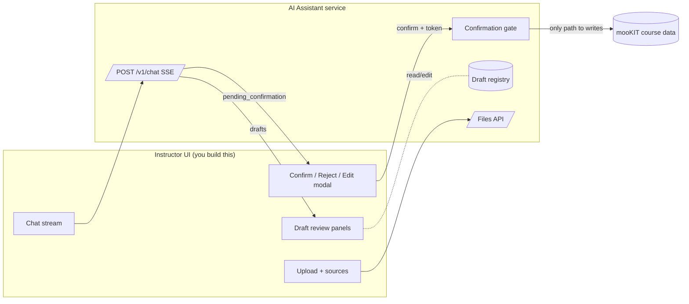
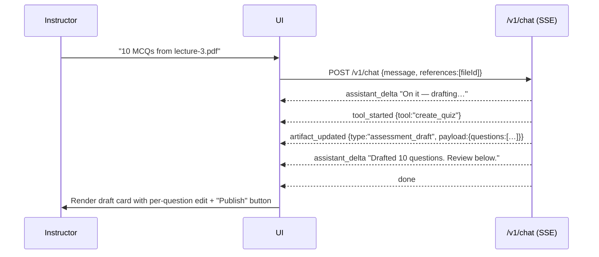
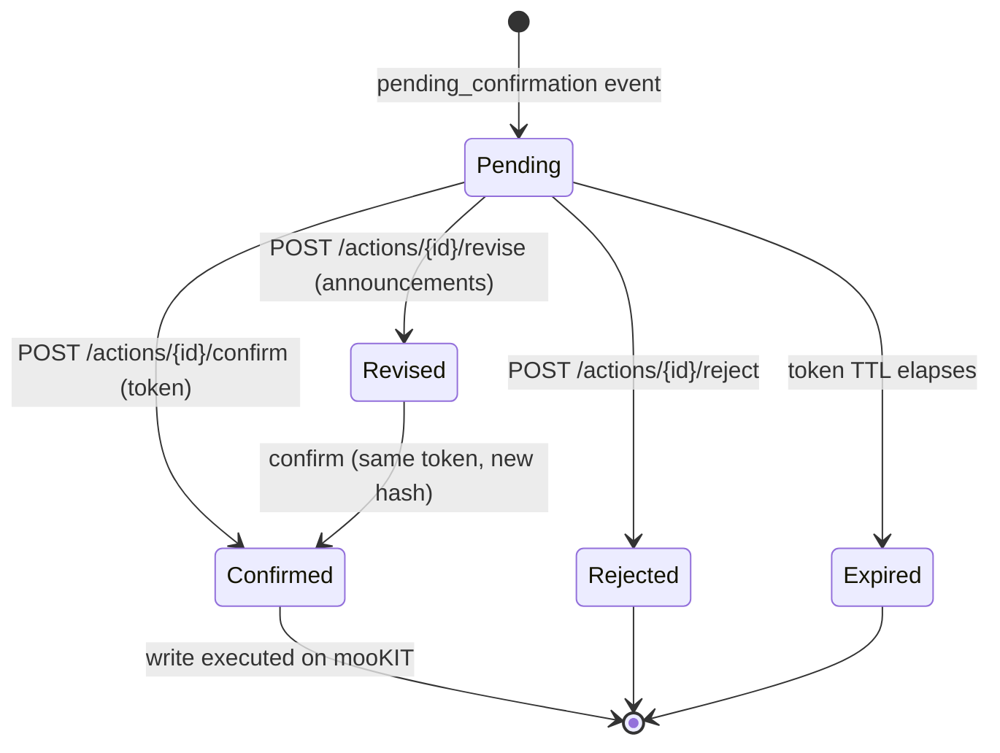
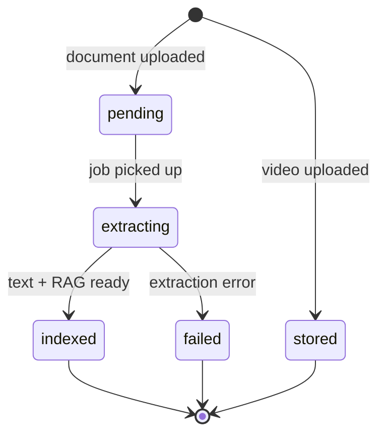

# mooKIT AI Assistant — UI Integration & Build Guide

**Audience:** the frontend team building the production instructor-facing UI.
**Scope:** everything you need to consume this service — the runtime model, the HTTP/SSE contract, the data shapes, the screens and flows worth building, and the few things that are still on the roadmap.
**Status of this doc:** describes commit `54ec356` (adaptive quiz routing, verbatim replicate, @-mentions, diagram preview). Anything not yet shipped is called out explicitly under **[ROADMAP]** tags so you can design forward-compatibly.

There is a working reference implementation in `sample-ui/index.html` — a single-file vanilla-JS demo that exercises nearly every endpoint here. It is a *demo*, not a design target. Treat it as the executable spec for "how the wire actually behaves," and treat this document as the spec for "what to build and why."

---

## 1. The one idea to internalize first

This is not a CRUD API with a chat box bolted on. It is an **assistant that proposes, and a human that disposes.** Three concepts carry the entire product:

1. **The stream.** The instructor talks to the assistant over a single streaming endpoint (`POST /v1/chat`, Server-Sent Events). Everything the assistant *does* arrives as typed events on that stream — text, "I'm calling a tool," "here's a draft," "please confirm this," "I need to ask you something."

2. **Artifacts (drafts).** The assistant never edits live course data while it works. It produces **drafts** — a quiz draft, an announcement draft, a lecture draft — that live in this service. Drafts are versioned and editable. Nothing in a draft is on mooKIT.

3. **The confirmation gate.** The only way anything reaches the real course (publish a quiz, send an announcement, publish a lecture) is: the assistant emits a **pending confirmation**, the human reviews an exact preview, and the human explicitly confirms it with a one-time token. The model literally cannot publish. This is a hard security boundary, not a UX nicety — your UI is the surface that makes this boundary legible and trustworthy.

If your UI makes those three things feel natural — streaming conversation, reviewable drafts, and a confident "review → confirm" moment — the product works. Everything below is in service of that.



---

## 2. Where this UI runs, and how auth works

### 2.1 Embedding assumption

The production UI is expected to run **embedded inside mooKIT** (the instructor is already logged into mooKIT; your UI is hosted in that context). That means **the host environment supplies the identity** — you do not build a login screen. Concretely, the host must make three values available to your UI so you can attach them to every request to this service:

| Value | Meaning |
|---|---|
| `course` | The mooKIT course id the instructor is working in |
| `token` | The instructor's mooKIT auth token (used by this service to call mooKIT on their behalf) |
| `uid` | The instructor's numeric mooKIT user id |

How you obtain those three from the mooKIT host page (query params, `postMessage`, an injected global, a cookie) is a mooKIT-side integration detail that the two teams need to nail down — see [Open questions](#16-open-questions-to-align-on). Whatever the mechanism, the **contract this service enforces is the header contract below**, and that is the source of truth.

> **[ROADMAP / non-embedded]** If a standalone deployment is ever needed, the only thing that changes is *how you acquire* `course`/`token`/`uid`; the header contract stays identical. Design your API client so the credential source is swappable.

### 2.2 The header contract (every request)

Send these on **every** call to the service (chat, files, confirm, meta — all of it):

```http
course: <course-id>
token:  <mookit-token>
uid:    <numeric-user-id>
```

Optional but recommended:

| Header | Default | Purpose |
|---|---|---|
| `x-session-id` | a new UUID per request | Conversation continuity. **Set this and keep it stable** for a conversation, otherwise each turn starts a fresh session. |
| `x-instance-id` | `"default"` | Multi-tenant instance selector. Usually fixed per deployment. |
| `role` | `"instructor"` | Reserved; leave as instructor. |

`course`/`token`/`uid` also have `x-` aliases (`x-course`, `x-token`, `x-user-id`) if header naming collides with something in the host page. For `POST /v1/chat`, `sessionId` and `instanceId` may alternatively be passed in the JSON body.

The service derives a **tenant key** of `"{instanceId}:{course}"` internally — you never construct it, but it explains why every artifact, file, and session is scoped: nothing leaks across courses.

### 2.3 What happens when auth is wrong

- **Missing `course`/`token`/`uid`** → `401` with `{"detail": "Missing required auth headers: course, token, uid"}`. This is a wiring bug; surface it loudly in dev, gracefully in prod.
- **Valid headers but mooKIT rejects them** → the service can't load permissions and **fails closed**: every capability is denied. The symptom is a `403` on writes and an empty `permissions` object from `GET /v1/meta`. Your UI should detect `permissionsOk === false` from `/v1/meta` and show a clear "couldn't verify your course permissions" state rather than a pile of disabled buttons with no explanation. (This exact failure bit us during testing — it looks like the app is broken when it's actually an auth handshake problem.)

---

## 3. The chat stream — the heart of the integration

### 3.1 The request

```http
POST /v1/chat
Content-Type: application/json
course: …  token: …  uid: …  x-session-id: <stable-id>

{
  "message": "Make a 10-question quiz from the lecture-3 PDF",
  "sessionId": "conv-abc",          // optional; header x-session-id also works
  "instanceId": "default",          // optional
  "references": ["artifact-id-1"]   // optional; see @-mentions (§9)
}
```

The response is **`text/event-stream`** (SSE). Open it with `EventSource` (if you can attach headers via your transport) or, more commonly given the custom headers, with `fetch` + a streaming body reader. The demo UI uses `fetch` + manual SSE parsing precisely because the auth headers can't ride on a native `EventSource`. Plan for the same.

### 3.2 The events

Every event is `event: <name>` + `data: <json>`. These are the eight event types, exhaustively:

| Event | When | `data` shape |
|---|---|---|
| `assistant_delta` | Streaming assistant prose | `{ text: string }` — append, don't replace |
| `tool_started` | Assistant began an action | `{ tool: string, label: string }` |
| `tool_progress` | Long-running action progress | `{ tool: string, pct: number, message: string }` *(emitted opportunistically; fast tools may skip it — don't depend on it for correctness)* |
| `artifact_updated` | A draft was created or changed | `{ artifact_id, type, version, preview?, payload? }` |
| `pending_confirmation` | A write needs human confirmation | `{ action, action_id, confirm_token, target_ref, content_hash, preview, expires_at }` |
| `clarification` | The assistant needs a decision from the user | `{ preamble?, questions: ClarificationQuestion[] }` |
| `error` | Something failed | `{ code, message, retryable }` |
| `done` | Turn finished | `{ response_id }` |

A turn **always** ends with exactly one terminal event: `done` (normal), or it stops after a `pending_confirmation`/`clarification` (both are followed by a `done`), or `error`. Your stream reader should treat `done` as "re-enable the composer."

### 3.3 TypeScript for the stream

```ts
type SseEvent =
  | { event: "assistant_delta";      data: { text: string } }
  | { event: "tool_started";         data: { tool: string; label: string } }
  | { event: "tool_progress";        data: { tool: string; pct: number; message: string } }
  | { event: "artifact_updated";     data: ArtifactUpdated }
  | { event: "pending_confirmation"; data: PendingConfirmation }
  | { event: "clarification";        data: ClarificationRequest }
  | { event: "error";                data: { code: string; message: string; retryable: boolean } }
  | { event: "done";                 data: { response_id: string } };

interface ArtifactUpdated {
  artifact_id: string;
  type: "assessment_draft" | "announcement_draft" | "lecture_draft" | "uploaded_file";
  version: number;
  preview?: PreviewRender;   // present for things that can be previewed
  payload?: DraftPayload;    // present when type ends with "_draft" — render this
}
```

### 3.4 Golden path: "draft a quiz" turn



Key implementation notes from this path:
- When you get `artifact_updated` with a `_draft` payload, **render the draft inline in the conversation** (a rich card), not as a wall of JSON. The `payload` is everything you need (§5).
- Keep a client-side map of `artifact_id → latest version/payload`. Subsequent `artifact_updated` events for the same id are edits — re-render in place.
- The assistant's closing prose (`assistant_delta`) and the draft card are complementary: prose explains, the card is the workspace.

### 3.5 Practical streaming concerns

- **Heartbeats:** the server sends SSE pings to keep proxies from killing idle connections. Your parser should ignore comment/ping frames.
- **Disconnects:** if the user navigates away, just drop the connection — the server detects client disconnect and aborts cleanly.
- **Rate limiting:** chat is rate-limited per tenant; you may get a `429` *before* the stream opens. Handle it as "you're going too fast," not a stream error.
- **One in-flight turn at a time:** disable the composer between send and `done`. The conversation model assumes turns are sequential.

---

## 4. The confirmation gate — get this right

This is the single most important flow to build well. It is what makes the product safe to give an instructor.

### 4.1 The lifecycle



### 4.2 What you receive

When the assistant wants to write, you get a `pending_confirmation` event:

```ts
interface PendingConfirmation {
  action: "publish_assessment" | "send_announcement" | "publish_lecture";
  action_id: string;       // address this action
  confirm_token: string;   // one-time secret — required to confirm
  target_ref: Record<string, unknown>; // server-resolved target (ids), informational
  content_hash: string;    // binds the token to the exact payload
  preview: PreviewRender;  // render THIS — it is the faithful description of the write
  expires_at: string;      // ISO timestamp; after this, confirm will fail
}
```

The `preview` is the contract between the assistant and the human. **Render it faithfully and prominently** — it is deliberately a clean, human-readable summary of exactly what will happen:

```ts
interface PreviewRender {
  title: string;                 // "Publish quiz: Chapter 3 Quiz"
  summary_lines: string[];       // bullet summary of the change
  audience?: string;             // "142 students in CS101" (announcements/lectures)
  body_markdown?: string;        // rendered announcement/lecture body (already sanitized)
  diff?: { field: string; before: unknown; after: unknown }[]; // for updates
  warnings?: string[];           // "5 higher-order Bloom questions — review carefully"
}
```

Design guidance:
- Surface `title` as the modal header, `summary_lines` as the body, `warnings` in an unmissable callout (amber). For announcements/lectures, show `audience` and render `body_markdown`.
- Show a countdown or at least a relative "expires in N min" from `expires_at`. If it expires, the confirm call 404s — guide the user to ask the assistant again rather than showing a raw error.

### 4.3 The three actions

**Confirm** — the only path to a real write:
```http
POST /v1/actions/{action_id}/confirm
{ "confirm_token": "<from the event>" }
→ 200 { "success": true, "data": <mooKIT result> }
→ 404 if token invalid / already used / expired / payload hash changed
```
On success, the write has happened on mooKIT. Reflect it: mark the draft as published, disable the confirm UI, and let the assistant's next prose confirm it. The token is single-use — never retry a confirmed action.

**Reject** — discard the proposal (no token needed; you can always reject your own proposal):
```http
POST /v1/actions/{action_id}/reject
→ 200 { "success": true, "message": "Action … rejected." }
```

**Revise** — *announcements only, today* — edit the proposal before confirming:
```http
POST /v1/actions/{action_id}/revise
{ "title": "Updated subject", "description": "Updated **body**" }
→ 200 { "success": true, "preview": PreviewRender, "content_hash": "…" }
```
Revise re-derives the stored payload, preview, and hash server-side, then you confirm with the **same** `confirm_token`. This is what lets an instructor tweak wording in the review modal without going back to chat. Use the returned `preview` to re-render the modal in place.

> **[ROADMAP] richer review-and-edit:** today only announcement title/body are revisable pre-confirm. Planned: editing quiz settings (dates, timing, attempts, negative marking) and announcement audience/schedule/email-toggle/attachments directly in the confirm modal. **Design the confirm modal as an editable surface**, not a read-only alert, so these slot in without a redesign. See §12 and §15.

### 4.4 Why your UI must not "auto-confirm"

Never wire a flow that confirms without an explicit, deliberate human click on a screen that shows the preview. The whole security model (and the instructor's trust) rests on the human seeing exactly what will happen and choosing it. The token + hash machinery exists so that *what was reviewed is byte-for-byte what executes*.

---

## 5. Artifacts & drafts — what to render

Drafts arrive in `artifact_updated.payload` (during a turn) and can be re-fetched after edits via the deterministic routes (§6). Each artifact also carries `provenance` you should surface as a trust signal.

### 5.1 Common provenance

```ts
interface Provenance {
  ai_generated: boolean;     // false for verbatim replicas
  edited_by_human: boolean;  // true once anyone edits it
  source_ids?: string[];     // uploaded file ids this was built from
  label?: string;            // e.g. "Reproduced verbatim from uploaded paper · review before publishing"
}
```
Render a small badge: "AI-generated", "AI-generated · edited by you", or (for replicas) the `label`. Instructors care a lot about provenance — it's the difference between "the AI made this up" and "this is your exam, transcribed."

### 5.2 Quiz draft (`assessment_draft`)

```ts
interface QuizDraftPayload {
  questions: QuizQuestion[];
  params: { count: number; difficulty: string; bloom_level: string; reading_level: string; type_mix: Record<string, number> };
  warnings: string[];               // surface these above the questions
  source_artifact_ids: string[];    // file ids it was built from
  source_artifact_id?: string;      // legacy single-source convenience
  mode?: "replicate";               // present only for verbatim replicas
}

interface QuizQuestion {
  questionType: "mcq_single" | "mcq_multi" | "true_false" | "fib" | "descriptive";
  questionText: string;
  bloom_level: "remember" | "understand" | "apply" | "analyze" | "evaluate" | "create";
  score: number;
  negativeScore: number;
  citation: Citation;               // the grounding span (always present)
  citations?: Citation[];           // multiple spans for synthesis questions
  flags?: string[];                 // e.g. "verbatim", "answer_key_unverified"
  options?: { optionText: string; isCorrect: boolean; misconception?: string }[];
  trueFalseAnswer?: 0 | 1;          // true_false
  blanks?: unknown[];               // fib
  fibUseRange?: boolean; fibRangeLower?: number; fibRangeUpper?: number; // numeric fib
  solution?: { solution_expr?: string; answer?: string | number; unit?: string };
  rubric?: { criteria?: { criterion: string; points: number }[] };       // descriptive
  diagram?: QuestionDiagram;        // attached figure (see §8)
}

interface Citation { source_id: string; locator: Record<string, unknown>; quote: string; }
interface QuestionDiagram { file_id: string; diagram_file: string; description: string; page: number; question_number?: string; }
```

How to render a quiz draft well:
- One card per question: type chip, Bloom chip (highlight higher-order analyze/evaluate/create), stem, options with the correct one marked, marks line, and the **grounding citation** ("Source: …'quote'") — the citation is a core trust feature; don't hide it.
- Show `flags` per question (e.g. `answer_key_unverified` → "set the correct answer before publishing").
- Show draft-level `warnings` at the top.
- Diagrams: see §8 — they must be fetched as authenticated blobs.
- Provide per-question affordances that map 1:1 to the edit ops (§6): edit text, regenerate, replace, change type, flag, delete; plus draft-level add / set difficulty.

### 5.3 Announcement draft (`announcement_draft`)

```ts
interface AnnouncementDraftPayload {
  title: string;
  description: string;          // markdown
  type: "normal" | "urgent";
  notify_mail: boolean;         // also email it
  audience_intent: string;      // INTENT label like "all" / "Week 4 students" — NOT resolved ids
}
```
Render subject + markdown body + an "urgent" flag + "also emails students" indicator + the audience *intent*. **The audience is an intent string, never recipient ids** — the server resolves real recipients at confirm time. Don't try to expand it client-side.

### 5.4 Lecture draft (`lecture_draft`)

```ts
interface LectureDraftPayload {
  title: string;
  week_label: string;
  week_id?: number | null;      // null until resolved to a real course week
  module_label?: string;
  topic_id?: number | null;
  release_on?: number | null;   // unix seconds; null => publish now
  description?: string;
  file_artifact_id?: string;    // local uploaded video id
  file_mookit_id?: number;      // mooKIT fileId once known
  ambiguous?: boolean;          // week_label couldn't be resolved
}
```
If `week_id` is null / `ambiguous` is true, the week didn't resolve — prompt the instructor to specify the week (the assistant will usually do this via a clarification). Publishing a lecture with an unresolved week is blocked server-side, so catch it in the UI first.

---

## 6. Deterministic side-routes — buttons that don't go through chat

Chat is great for intent ("make it harder"). But for **button clicks you want to be reliable and instant**, the service exposes deterministic HTTP routes that run the *same* underlying logic as the chat tools, return the updated draft, and don't spend an LLM round-trip. Prefer these for direct manipulation; use chat for conversational intent.

### 6.1 Edit a quiz draft

```http
POST /v1/quiz/{draft_id}/edit
{ "op": "<op>", …op-specific fields }
→ 200 { success, artifact_id, version, title, payload, provenance }
```

| `op` | Fields | Effect |
|---|---|---|
| `edit_text` | `index`, `questionText` | Replace a question's stem (marks human-edited) |
| `regenerate` | `index`, `instruction?` | Re-draft one question, re-grounded |
| `replace_similar` | `index` | Swap in a fresh question on the same concept |
| `change_type` | `index`, `qtype` | Convert a question's type |
| `flag` | `index`, `reason?` | Flag a question for review |
| `remove` | `index` | Delete a question |
| `add` | `qtype`, `delta` | Add N questions of a type |
| `set_difficulty` | `difficulty` | Re-tune the whole quiz (`easy`/`medium`/`hard`/`mixed`) |

Returns the **full updated payload** — re-render the card from it. Requires `assessments:update` (gate the buttons on it).

### 6.2 Edit an announcement draft

```http
POST /v1/announcement/{draft_id}/edit
{ "title"?: string, "description"?: string }
→ 200 { success, artifact_id, version, title, payload, provenance }
```
Requires `announcements:create`. Body is markdown-sanitized server-side.

> Note the distinction: `/v1/announcement/{id}/edit` edits the **draft** (pre-proposal). `/v1/actions/{id}/revise` edits a **pending proposal** (post-"send", pre-confirm). Both exist; use the one that matches where the user is in the flow.

---

## 7. Files — sources for everything

Quizzes, replicas, and lectures all start from uploaded files. This is its own mini-subsystem with an async lifecycle you must reflect in the UI.

### 7.1 Upload

```http
POST /v1/files            (multipart/form-data, field name: file)
→ 200 { fileId, jobId, fileKind: "document"|"video", extractionStatus, ready, artifact }
```
Allowed types (also returned by `/v1/meta.allowedFileTypes`): `.pdf .docx .pptx .xlsx .csv .txt` (documents) and `.mp4 .mov .webm .mkv .m4v` (videos). Max size is in `/v1/meta.limits.maxFileSizeBytes`. The server validates by **magic bytes**, not extension — a renamed file will be rejected with a `400`; show the real reason.

Requires `files:upload`.

### 7.2 The lifecycle (and why polling matters)

Documents are processed in the background: text extraction → RAG indexing → diagram extraction. Videos are just stored. You must poll:

```http
GET /v1/files/{fileId}/status
→ { fileId, filename, filesize, extractionStatus, chunkCount, progress, fileKind, ready, diagrams }
```



- `ready` is `true` when the file is usable (`indexed` for docs, `stored` for videos). **Only let the user build a quiz from a file once `ready`.**
- `progress` carries job progress when available; use it for a progress bar.
- `diagrams` becomes non-null after diagram extraction completes (a second phase, *after* `indexed`) — so keep polling a bit past `indexed` if you want to show diagrams. **Don't stop polling the moment `extractionStatus === "indexed"`** or you'll miss diagrams. (This was a real bug in the demo; learn from it.)

```ts
interface FileStatus {
  fileId: string; filename: string; filesize: number;
  extractionStatus: "pending" | "extracting" | "indexed" | "stored" | "failed";
  chunkCount: number | null;
  progress: { pct?: number; message?: string } | null;
  fileKind: "document" | "video";
  ready: boolean;
  diagrams: DiagramExtractionResult | null;
}
interface DiagramExtractionResult {
  file_id: string; diagrams: DiagramInfo[]; total_pages: number; total_diagrams: number;
  status: "complete" | "failed" | "skipped"; error?: string | null;
}
interface DiagramInfo {
  page_number: number; question_index: number; question_number?: string | null;
  question_text: string; diagram_description?: string | null; diagram_file: string;
}
```

### 7.3 Delete

```http
DELETE /v1/files/{fileId}  → { success, fileId, deleted }
```
Removes the file, its RAG chunks, and its draft-manifest entry. mooKIT is never touched — uploads live only in this service.

---

## 8. Diagrams — figures attached to questions

When a question paper has figures (circuits, graphs, anatomy diagrams) that questions depend on, the service extracts and crops them, and — for verbatim replicas — **links each figure to its question**. The UI should preview the figure inline with the question.

Two ways figures show up:
1. **Per file:** `GET /v1/files/{id}/status` → `diagrams.diagrams[]` (all figures found in a doc).
2. **Per question:** `QuizQuestion.diagram` on a replica draft (the figure that belongs to *that* question).

**Fetching the image:** the crop is served as a PNG, but it's tenant-scoped and requires your auth headers — so you **cannot** put the URL directly in ``. Fetch it as a blob and use an object URL:

```ts
async function diagramObjectUrl(fileId: string, diagramFile: string): Promise<string | null> {
  const res = await fetch(
    `${base}/v1/files/${encodeURIComponent(fileId)}/diagrams/${encodeURIComponent(diagramFile)}`,
    { headers: authHeaders() }
  );
  if (!res.ok) return null;
  return URL.createObjectURL(await res.blob());
}
```

Render `QuizQuestion.diagram` as a `<figure>` under the stem with `description` as the caption. If the fetch fails, degrade to a "figure unavailable" caption rather than a broken image. Remember to `revokeObjectURL` on unmount.

---

## 9. @-mentions — pointing the assistant at things

Instructors will say "make a quiz from *this*." Rather than hoping the model guesses, let them **tag artifacts** (uploaded files, existing drafts) and pass the ids in `references`:

```jsonc
POST /v1/chat
{ "message": "Replicate this question paper", "references": ["file-uuid-1"] }
```

The service injects the tagged items authoritatively into the turn ("the user explicitly means these"), so the assistant uses the right source without asking which one. Build an **@-mention autocomplete** sourced from the user's uploaded files and current-session drafts, render the picked items as removable chips above the composer, and send their ids in `references`. Unknown/foreign ids are silently ignored server-side, so it's safe.

---

## 10. Clarifications — when the assistant asks *you*

Instead of guessing consequential decisions (how many questions? which document? what audience?), the assistant can ask the instructor a structured question. You get a `clarification` event and the turn ends; the user's answer is just the **next chat message**, which auto-continues the task.

```ts
interface ClarificationRequest {
  preamble?: string;
  questions: {
    id: string;
    prompt: string;
    options: { id: string; label: string }[];
    allow_multiple: boolean;   // checkboxes vs radios
    allow_free_text: boolean;  // show an "Other…" input
  }[];
}
```

Build this as a card with radios (single) or checkboxes (multi) per question, plus an "Other" free-text box when `allow_free_text`. On submit, compose the selections into a short natural-language message and send it as a normal `POST /v1/chat` turn. (The demo formats it like `"Question <id>: Selected option(s) …"`, which works well because the assistant kept the question context in the transcript.) This is the same multiple-choice-with-escape-hatch UX you'd want anyway — make it feel native, not like an error.

---

## 11. Sessions & history

```http
GET /v1/sessions/{session_id}
→ { id, tenantKey, createdAt, summary, messages: [{ role, content }] }
```
Use this to **rehydrate a conversation** when the instructor returns. Keep the `x-session-id` stable to maintain continuity within a conversation; generate a new one to start fresh. There is no "list all sessions" endpoint yet — see roadmap. Drafts referenced in an old session are re-fetchable by id via the edit routes if you persisted their ids.

---

## 12. Capability catalog → UX surfaces

This maps what the assistant can actually do to the screens worth building. Every capability is permission-gated (§13) and, for writes, gated again by the confirmation gate.

| Capability | How it's triggered | Draft type | UX surface to build |
|---|---|---|---|
| Generate a quiz from sources | chat (`create_quiz`, generate) | `assessment_draft` | Source picker → quiz draft card with per-question edits |
| Replicate a question paper verbatim | chat (`create_quiz`, replicate) | `assessment_draft` (`mode:"replicate"`) | Same card; provenance badge; inline diagrams |
| Edit quiz questions | chat or `POST /v1/quiz/{id}/edit` | updates draft | Inline per-question controls + difficulty knob + add |
| Publish a quiz | chat (`publish_assessment`) → confirm | — | Review-and-confirm modal |
| Draft an announcement | chat (`draft_announcement`) | `announcement_draft` | Announcement editor (subject/body/urgent/email/audience) |
| Edit an announcement | `POST /v1/announcement/{id}/edit` | updates draft | Inline editor |
| Send an announcement | chat (`send_announcement`) → confirm/revise | — | Review modal with editable subject/body |
| Draft a lecture (+ video) | upload video → chat (`draft_lecture`) | `lecture_draft` | Week/module picker + video attach |
| Publish/schedule a lecture | chat (`publish_lecture`) → confirm | — | Review modal with schedule/visibility |
| Resolve course structure | chat (`resolve_taxonomy`) | — | (today) implicit; (roadmap) live pickers |
| Who am I / what can I do | chat (`whoami`, `my_permissions`) | — | Settings/debug panel |

> **[ROADMAP] live taxonomy pickers.** Today, week/module/section resolution happens *inside* a chat turn via `resolve_taxonomy` (no dedicated HTTP endpoint). Planned: a read endpoint exposing the course's weeks/modules/sections so your UI can render real dropdowns for "publish to Week 4," "announce to Section B," etc., instead of free-text intent. Until then, treat week/audience as free-text intent the assistant resolves, and handle the `ambiguous`/clarification path.

---

## 13. Permissions & feature flags — gating the UI

Call `GET /v1/meta` on load:

```ts
interface Meta {
  instanceId: string; tenantKey: string; courseId: string; userId: number;
  permissionsOk: boolean;                       // false => auth handshake problem (§2.3)
  permissions: Record<string, string[]> | null; // { assessments: ["create","update","publish"], … }
  limits: { maxFileSizeBytes: number; maxMessagesPerSession: number; maxContextTokens: number; rateLimitRpm: number };
  allowedFileTypes: string[];
  quizFeatures: { blueprintEnabled: boolean; visionEnabled: boolean };
}
```

Gate UI on `permissions[resource]?.includes(action)`. The resources/actions in play:

| Resource | Actions | Gates |
|---|---|---|
| `assessments` | `create`, `update`, `publish` | quiz create / edit / publish |
| `announcements` | `create`, `publish` | announcement draft+edit / send |
| `lectures` | `create`, `publish` | lecture draft / publish |
| `files` | `upload` | file upload / delete |

Two layers, both worth respecting:
1. **Server already filters the assistant's tools** by permission — the model won't offer to publish if the user can't. So the chat path is safe by construction.
2. **You must still gate your own buttons and direct routes** (edit/confirm/upload) — the deterministic routes enforce permissions and will `403`, but the UI should hide/disable rather than let the user hit a wall.

Use `limits` for client-side validation (file size, friendly "slow down" on `rateLimitRpm`). `quizFeatures` flags are informational — they tell you whether richer quiz generation (blueprint/vision) is enabled for this instance; you generally don't need to branch UI on them, but they're there if you want to message capabilities.

---

## 14. Endpoint reference (appendix)

All paths are under the service origin. `*` = requires the `course`/`token`/`uid` headers (i.e. all of them).

| Method | Path | Purpose | Permission |
|---|---|---|---|
| `POST` | `/v1/chat` * | Streaming conversation (SSE) | — (tools self-gate) |
| `GET` | `/v1/sessions/{id}` * | Conversation history | — |
| `POST` | `/v1/files` * | Upload a source file | `files:upload` |
| `GET` | `/v1/files/{id}/status` * | Poll extraction/diagram progress | — |
| `GET` | `/v1/files/{id}/diagrams/{file}` * | Cropped diagram PNG (fetch as blob) | — |
| `DELETE` | `/v1/files/{id}` * | Delete file + derived data | `files:upload` |
| `POST` | `/v1/quiz/{id}/edit` * | Deterministic quiz edit | `assessments:update` |
| `POST` | `/v1/announcement/{id}/edit` * | Deterministic announcement edit | `announcements:create` |
| `POST` | `/v1/actions/{id}/confirm` * | Execute a pending write | re-checked at execute |
| `POST` | `/v1/actions/{id}/reject` * | Discard a pending write | — |
| `POST` | `/v1/actions/{id}/revise` * | Edit a pending announcement | `announcements:publish` |
| `GET` | `/v1/meta` * | Limits, permissions, flags | — |
| `GET` | `/health` | Liveness | — |

---

## 15. Error handling & edge states (build these, not just the happy path)

A trustworthy assistant UI is mostly about handling the unhappy paths gracefully.

- **`401` on any call** → auth headers missing/malformed. Dev: loud. Prod: "session expired, reload."
- **`permissionsOk: false`** → permissions couldn't be loaded; show a dedicated banner, not a sea of disabled buttons.
- **`403` on a write** → the user lacks the permission (or it was revoked mid-session). Hide the affordance and explain.
- **`429`** → rate limited; back off, tell the user.
- **`error` SSE event** → show `message`; if `retryable`, offer a retry button.
- **`pending_confirmation` expired** (`expires_at` passed, or confirm 404s) → "this proposal expired, ask again," not a stack trace.
- **Confirm 404** → token already used / payload changed / expired — all collapse to "couldn't confirm; re-request." (Intentionally vague server-side for security; don't try to distinguish.)
- **File `failed`** → extraction failed; let them re-upload or pick another file. Don't let them build a quiz from a failed/not-`ready` file.
- **Empty states** → no files yet, no drafts yet, no permissions — each deserves a purposeful first-run prompt.
- **Loading states** → streaming (assistant is typing), tool running (`tool_started` with `label`), file processing (progress bar from `/status`).
- **Diagram fetch failure** → "figure unavailable" caption, never a broken image.

---

## 16. Open questions to align on

These need a decision between the mooKIT/host team, this service's team, and you:

1. **Credential delivery:** exactly how does the embedding host hand `course`/`token`/`uid` to your UI (query param? `postMessage`? injected global? cookie)? And how is token refresh handled if the mooKIT session rolls over mid-conversation?
2. **Session ownership:** who generates and persists `x-session-id` across reloads — your UI (localStorage) or the host? Do we want a "resume previous conversations" list (needs a new "list sessions" endpoint — not built)?
3. **Taxonomy pickers:** is the live-taxonomy read endpoint in scope for v1, or do we ship with free-text intent + clarifications first? (Affects how much of the announcement/lecture UI you build now.)
4. **Confirm-modal editability:** how much pre-publish editing do we want in v1 (announcement body only, today) vs the fuller quiz-settings/announcement-controls roadmap? Build the modal editable regardless.
5. **Multi-draft management:** if a session accumulates several drafts, do we want a persistent "drafts" panel, and should publish always target an explicit draft id (recommended — ambiguity here previously caused the wrong draft to publish)?
6. **Real-time across tabs:** is a single SSE stream per conversation sufficient, or do we need cross-tab/draft sync?

---

## 17. Quick-start checklist for the UI team

1. On load: `GET /v1/meta`. If `permissionsOk` is false, show the auth banner and stop. Otherwise cache `permissions` + `limits`.
2. Build the **chat stream** client (`fetch` + SSE parser) handling all 8 events; render `assistant_delta` incrementally and `done` to re-enable input.
3. Build **draft cards** for `assessment_draft` / `announcement_draft` / `lecture_draft` from `artifact_updated.payload`, with provenance badges.
4. Build the **confirm modal** from `pending_confirmation.preview`; wire confirm/reject (and revise for announcements). Make it editable-ready.
5. Build **file upload + status polling** (poll past `indexed` for diagrams) and the **diagram blob fetch**.
6. Build **clarification cards** and **@-mention** chips.
7. Gate every button on `permissions`; handle the error/edge states in §15.
8. Use `sample-ui/index.html` as the behavioral reference whenever the wire is unclear.

---

*This document reflects the service at commit `54ec356`. When the backend adds the roadmap items (live taxonomy, richer confirm-modal editing, session listing), this doc should be updated alongside them.*
