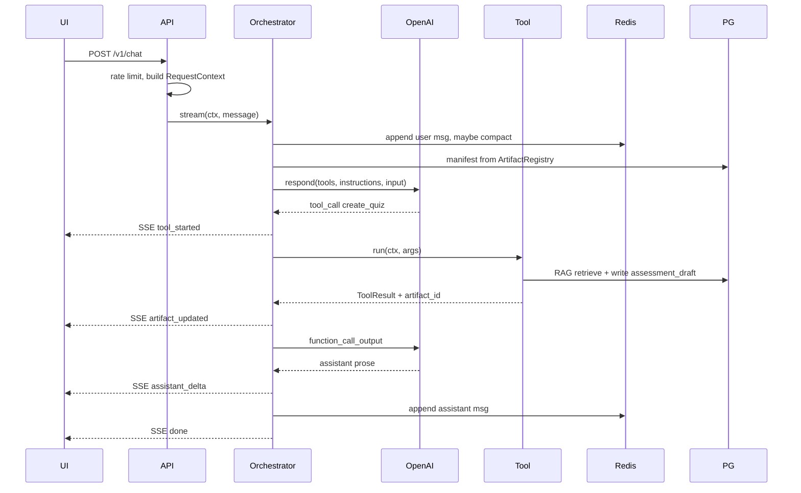
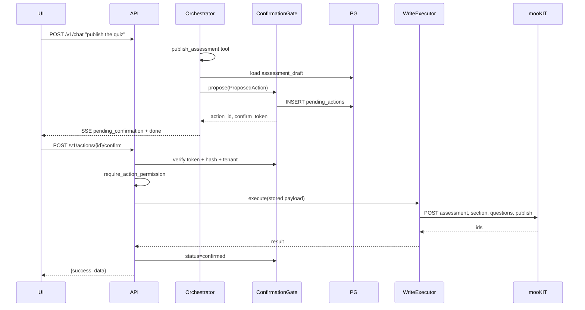
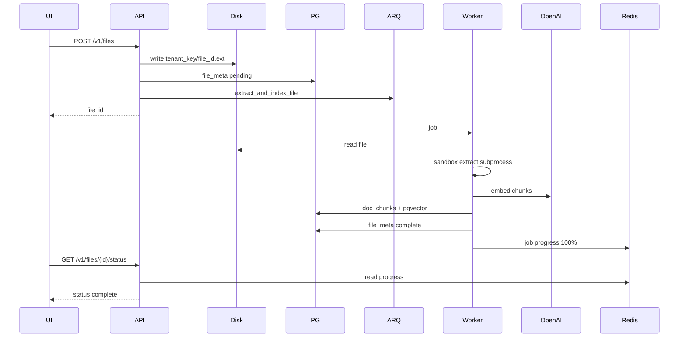

# mooKIT AI Assistant — Dev Architecture

Standalone microservice: natural-language interface for instructors → grounded quizzes, announcements, lectures on mooKIT.

**Write invariant:** publish tools return `ProposedAction` only. mooKIT mutations run exclusively via `ConfirmationGate` → `DeterministicExecutor` after `POST /v1/actions/{id}/confirm`. LLM loop never writes to mooKIT.

---

## Stack


| Layer       | Tech                                                        |
| ----------- | ----------------------------------------------------------- |
| API         | FastAPI, Uvicorn, sse-starlette                             |
| LLM         | OpenAI Responses API (`responses.parse` for structured gen) |
| HTTP        | httpx HTTP/2, shared pool (200 conn / 50 keepalive)         |
| DB          | Postgres 16 + pgvector, SQLAlchemy 2 async, Alembic         |
| Cache/queue | Redis 7, ARQ worker                                         |
| Config      | Pydantic Settings, nested env `FOO__BAR`                    |
| Resilience  | tenacity retries, per-client circuit breaker                |
| Extract     | pdfminer, python-docx, pypdfium2 — sandboxed subprocess     |
| Runtime     | Python 3.10+ (3.12 in Docker), `uv`                         |


---

## Topology

```
Frontend ──(course, token, uid)──► FastAPI :8000
                                      │
                    ┌─────────────────┼─────────────────┐
                    ▼                 ▼                 ▼
              Orchestrator    ConfirmationGate      Stores
              + Tools         + WriteExecutor       PG + Redis
                    │                 │                 ▲
                    ▼                 ▼                 │
                 OpenAI            mooKIT REST      ARQ worker
```


| Process             | Role                                        |
| ------------------- | ------------------------------------------- |
| `deploy-api-1`      | HTTP + SSE, enqueue jobs                    |
| `deploy-worker-1`   | extract → chunk → embed                     |
| `deploy-postgres-1` | artifacts, RAG vectors, pending_actions     |
| `deploy-redis-1`    | transcripts, cache, ARQ broker, rate limits |


Shared Docker volume: `/tmp/mookit_uploads` on api + worker.

---

## Architecture

### Logical layers

```
┌─────────────────────────────────────────────────────────────────┐
│ Presentation   sample-ui / mooKIT frontend (SSE client, upload) │
├─────────────────────────────────────────────────────────────────┤
│ API            FastAPI routers — chat, files, confirm, health   │
│                middleware: CORS, service-key, rate limit        │
├─────────────────────────────────────────────────────────────────┤
│ Domain         Orchestrator, Tools, QuizPipeline, ReferenceResolver│
│                TranscriptManager, Guardrails, Preview builders  │
├─────────────────────────────────────────────────────────────────┤
│ Write path     ConfirmationGate, DeterministicExecutor (no LLM) │
├─────────────────────────────────────────────────────────────────┤
│ Integration    MooKitClient, OpenAIProvider, OpenAIEmbedder       │
├─────────────────────────────────────────────────────────────────┤
│ Data           RedisSessionStore, DurableArtifactRegistry,      │
│                PgVectorRAGStore, AuditLogger, ARQ worker        │
└─────────────────────────────────────────────────────────────────┘
```

Upper layers depend on contracts; integration + data wired once at startup.

### Control vs data paths

| Path | Carries | Mutates mooKIT |
|------|---------|----------------|
| **Chat control** | user text → tool selection → draft artifacts | no |
| **Chat data** | RAG spans, tool results, assistant prose → SSE | no |
| **Confirm control** | confirm_token → gate verify → executor dispatch | **yes** |
| **Background data** | file bytes → text → embeddings → doc_chunks | no |

LLM participates only in chat control + draft content generation. mooKIT writes are confirm control only.

### Dual execution model

```
                    ┌──────────────────────────────────────┐
                    │           Orchestrator loop           │
                    └─────────────────┬────────────────────┘
                                      │ tool_call
              ┌───────────────────────┴───────────────────────┐
              ▼                                               ▼
     risk_tier: read | draft                          risk_tier: publish
              │                                               │
              ▼                                               ▼
        Tool.run() → ToolResult                      Tool.run() → ProposedAction
              │                                               │
              ▼                                               ▼
     artifact_registry / mookit read              ConfirmationGate.propose()
              │                                               │
              ▼                                               ▼
     function_call_output → LLM loop              pending_actions (PG)
     (continues same HTTP/SSE)                              │
                                                            │ separate HTTP
                                                            ▼
                                                   POST .../confirm
                                                            │
                                                            ▼
                                                   DeterministicExecutor
                                                            │
                                                            ▼
                                                      mooKIT REST writes
```

Publish branch **never** feeds back into LLM in same turn. Confirm is always a second request.

### Component dependencies

```
RequestContext ──► every handler, tool, store, client call
       │
       ├──► ToolRegistry ──► Tool implementations
       │         ├── CreateQuizTool ──► QuizPipeline ──► RAG retrieve + generators
       │         ├── DraftLectureTool ──► MooKitClient (taxonomy read)
       │         └── Publish*Tool ──► ArtifactRegistry (read draft only)
       │
       ├──► Orchestrator
       │         ├── LLMProvider
       │         ├── SessionStore + TranscriptManager
       │         ├── ArtifactRegistry + ReferenceResolver
       │         ├── GuardrailHook
       │         └── proposal_sink → ConfirmationGate
       │
       └──► Confirm endpoint ──► ConfirmationGate ──► DeterministicExecutor ──► MooKitClient
```

Shared infra: one `httpx.AsyncClient`, one `AsyncOpenAI`, one Redis, one PG pool per API process.

### Multi-tenant isolation

```
tenant_key = "{instance_id}:{course_id}"
```

| Scope | Isolation key | Notes |
|-------|---------------|-------|
| Artifacts | `tenant_key` + `user_id` on list/get | user cannot read other user's drafts in same course |
| RAG chunks | `tenant_key` + `doc_id` | retrieve query always filters both |
| file_meta | `tenant_key` | upload path includes tenant segment |
| pending_actions | `tenant_key` | confirm rejects cross-tenant |
| transcript | `tenant_key` + `session_id` | |
| focus stack | `focus:{tenant_key}:{user_id}:{session_id}` | Redis list, max 10, 24h TTL |
| rate limit | `tenant_key` | |
| perm cache | tenant + user | |

`instance_id` selects mooKIT base URL via `instance_registry` when not `default`.

### Sequence: chat turn with draft tool



### Sequence: publish + confirm



Hash recompute on confirm blocks payload swap after user saw preview.

### Sequence: file upload + index



API returns before index done. Quiz tool must wait for `extraction_status=complete` or poll.

### State: pending action

```
                    propose()
         ┌──────────────────────────────┐
         │          pending             │
         └───────────┬──────────────────┘
                     │
       ┌─────────────┼─────────────┐
       │             │             │
   confirm()     reject()      TTL expiry
       │             │             │
       ▼             ▼             ▼
  confirmed      cancelled     (confirm fails 404)
  or failed
```

Token single-use. `confirmed` / `cancelled` / `failed` terminal. Executor failure marks `failed`, not retry with same token.

### State: file extraction

```
upload → pending → [ARQ running] → complete | failed
```

`file_meta.extraction_status` + Redis job progress. Worker failure leaves `failed`; re-upload new file_id.

### Memory architecture

```
┌──────────────────── Chat turn context ────────────────────┐
│ SYSTEM_PROMPT (static)                                     │
│ Artifact manifest ◄── ReferenceResolver ◄── focus stack   │
│                       ◄── ArtifactRegistry (PG)            │
│ Transcript view ◄── TranscriptManager ◄── SessionStore   │
│                                              (Redis)       │
│ User message (untrusted, last)                             │
└────────────────────────────────────────────────────────────┘

Parallel persistent state (not in transcript):
  assessment_draft | announcement_draft | lecture_draft | uploaded_file
  versioned JSON in PG — mutations via tools, not chat prose
```

Compaction drops old transcript text; artifact payloads unaffected.

### Quiz pipeline architecture

```
┌─────────────┐     ┌──────────────┐     ┌─────────────────┐
│  RAG store  │────►│ Evidence pick │────►│ QuestionGenerator│
│  pgvector   │     │ per slot      │     │ strict schema    │
└─────────────┘     └───────┬──────┘     └────────┬────────┘
                            │                       │
                   ┌────────▼────────┐     ┌────────▼────────┐
                   │ Blueprint (opt) │     │ Verify layer    │
                   │ Comprehender    │     │ numeric + flags │
                   │ Vision (opt)    │     │ solve-verify    │
                   └─────────────────┘     └────────┬────────┘
                                                      │
                                             ┌────────▼────────┐
                                             │ assessment_draft │
                                             │ artifact (PG)    │
                                             └─────────────────┘
```

Pipeline deps injected at wiring — swap fakes in tests without network.

### SSE streaming architecture

```
Client ◄── EventSourceResponse ◄── orchestrator.stream()
              │                      yields {event, data: json}
              ├── ping interval (keep-alive through proxies)
              └── disconnect check: request.is_disconnected() → abort, audit cancelled
```

Long-lived stream: no FastAPI DB `Depends` session — would close before stream ends.

Orchestrator owns transcript writes (user + assistant). Chat route does not duplicate user append.

### Package map

| package | owns |
|---------|------|
| `app/api/` | HTTP routes, SSE adapters, request models |
| `app/core/` | orchestrator, context, confirmation, executor, memory, guardrails, wiring |
| `app/contracts/` | interfaces shared across layers |
| `app/tools/` | tool implementations + registry |
| `app/gen/` | quiz pipeline, announcement/lecture generators |
| `app/llm/` | OpenAI provider, stream translation |
| `app/mookit/` | client, schemas, errors |
| `app/store/` | Redis/PG stores, RAG, embeddings |
| `app/files/` | upload validation, sandbox extract, render |
| `app/workers/` | ARQ tasks |
| `app/preview/` | PreviewRender builders |
| `app/audit/` | audit logger |
| `deploy/` | Docker Compose, Dockerfile, scripts |

### Design constraints (load-bearing)

1. **Plan-then-Execute** — tool choice before bulk untrusted text in reasoning channel.
2. **Publish proposes only** — no mooKIT write import in publish tool code paths.
3. **Stored payload execution** — executor reads PG row, not live LLM output at confirm.
4. **Hash-bound token** — `content_hash` over canonical JSON; edit draft → new propose required.
5. **Permission-filtered tool list** — model cannot invoke tools user lacks.
6. **Server-side ID resolution** — taxonomy, audience, file IDs from trusted APIs/stores.
7. **Tenant-scoped storage** — every query includes `tenant_key`.

---

## Runtime bootstrap

FastAPI `lifespan` builds singletons on `app.state`:


| Key                             | Type                                   | Use                                       |
| ------------------------------- | -------------------------------------- | ----------------------------------------- |
| `http_client`                   | httpx.AsyncClient                      | mooKIT + outbound                         |
| `redis`                         | aioredis                               | sessions, cache, rate limit, job progress |
| `db_engine` / `session_factory` | SQLAlchemy async                       | Postgres                                  |
| `arq_pool`                      | ArqRedis                               | enqueue background jobs                   |
| `mookit_client`                 | MooKitClient                           | typed LMS API                             |
| `session_store`                 | RedisSessionStore                      | transcript + summary                      |
| `artifact_registry`             | DurableArtifactRegistry                | PG durable + Redis hot                    |
| `rag_store`                     | PgVectorRAGStore (or keyword fallback) | retrieval                                 |
| `openai_client`                 | AsyncOpenAI                            | chat, embed, moderation                   |
| `audit_logger`                  | AuditLogger                            | log + PG append                           |
| `orchestrator`                  | Orchestrator                           | chat loop                                 |


Init order: HTTP → Redis → PG (+ optional `CREATE EXTENSION vector`, auto-create tables in dev) → ARQ → mooKIT client → stores → RAG → audit → orchestrator wiring.

Shutdown: close HTTP, Redis, engine. Uvicorn graceful timeout for in-flight SSE.

DB sessions for SSE: created **inside** the stream generator, not as route `Depends` — dependency sessions close before long streams finish.

---

## Contracts (test seams)

Abstract interfaces in `app/contracts/` — production impl swapped at wiring; tests use fakes.


| Interface                                | Role                                                  |
| ---------------------------------------- | ----------------------------------------------------- |
| `RequestContext`                         | tenant, user, session, permissions, forwarded headers |
| `Tool` / `ToolResult` / `ProposedAction` | tool dispatch + publish proposals                     |
| `LLMProvider` / `LLMEvent`               | provider-agnostic streaming                           |
| `MooKitClient`                           | LMS reads/writes                                      |
| `SessionStore`                           | transcript messages                                   |
| `ArtifactRegistry`                       | versioned drafts                                      |
| `PreviewRender`                          | confirm modal payload                                 |


---

## Auth, tenant, permissions

### Required headers

`course` (or `x-course`), `token` (or `x-token`), `uid` (or `x-user-id`). Missing → **401**.

Optional: `role`, `x-instance-id`, `x-session-id`, `session`, body `instanceId` / `sessionId`.

**Note:** mooKIT browser cookie has `token` + `uid`, not `course`. Frontend must send `course` = URL segment in `/v2/api/{course}/...`.

### RequestContext fields

```
instance_id     default "default"
course_id       from header
user_id         int from uid
tenant_key      "{instance_id}:{course_id}"
session_id      body/header or new UUID
request_id      new UUID per HTTP req
permissions     PermissionMatrix
forwarded_headers  {course, token, uid}
```

All DB queries and storage keys include `tenant_key`. Cross-tenant access blocked by construction.

### Permissions

Each request: `GET {base}/{course}/user_permissions/allowed` → flat `PermissionMatrix`:

```
viewEntity     → list, view, read
manageOwn/Others → create, update, delete, publish, upload, add, edit
```

Cached Redis ~300s.

Tools declare `required_permission = ("assessments", "create")`. Registry exposes only permitted tools to OpenAI — model never sees forbidden tools.

Confirm endpoint re-checks permissions (handles revocation between propose and confirm).


| Error                                                 | Cause                                               |
| ----------------------------------------------------- | --------------------------------------------------- |
| 401 (this service)                                    | bad/missing headers                                 |
| 403 (mooKIT) `/users/me`, `/user_permissions/allowed` | JWT ok, wrong `course`                              |
| 403 (mooKIT) writes                                   | no manage permission                                |
| 404 confirm                                           | bad token, expired, hash mismatch, already consumed |


---

## HTTP surface

### Middleware

CORS (`SECURITY__ALLOWED_ORIGINS`) → optional `x-service-key` guard → context `Depends` → global 500 handler.

Rate limit: Redis per `tenant_key`, `LIMITS__RATE_LIMIT_RPM`, checked **before** SSE headers on `/v1/chat` → 429.

### Routes


| Method   | Path                            | Notes                          |
| -------- | ------------------------------- | ------------------------------ |
| POST     | `/v1/chat`                      | SSE stream                     |
| POST     | `/v1/files`                     | multipart upload → ARQ job     |
| GET      | `/v1/files/{id}/status`         | extraction/index progress      |
| POST     | `/v1/actions/{id}/confirm`      | `{confirm_token}` → executor   |
| POST     | `/v1/actions/{id}/reject`       | cancel pending                 |
| POST     | `/v1/quiz/edit`                 | deterministic edit bypass chat |
| GET      | `/v1/meta`                      | service metadata               |
| GET/POST | `/v1/sessions/`*                | session mgmt                   |
| GET      | `/health/live`, `/health/ready` | liveness / DB+Redis            |
| GET      | `/ui`, `/docs`                  | sample UI, OpenAPI             |


### SSE events (`POST /v1/chat`)


| event                  | data                                              |
| ---------------------- | ------------------------------------------------- |
| `assistant_delta`      | `{text}`                                          |
| `tool_started`         | `{tool, label}`                                   |
| `tool_progress`        | `{tool, pct, message}`                            |
| `artifact_updated`     | `{artifact_id, type, version}`                    |
| `pending_confirmation` | `{action_id, preview, confirm_token, expires_at}` |
| `error`                | `{code, message, retryable, flags?}`              |
| `done`                 | `{response_id}`                                   |


Confirm flow (separate HTTP): UI sends `confirm_token` from `pending_confirmation` to `/v1/actions/{action_id}/confirm`.

---

## Chat turn

```
POST /v1/chat
  → rate limit
  → RequestContext + permissions
  → audit chat_start
  → Orchestrator.run_turn
       screen input (Moderation + heuristics; block → error + done)
       append user msg → Redis transcript
       maybe_compact transcript
       build input: manifest + transcript + user turn
       loop (max 8 rounds):
         OpenAI Responses stream (previous_response_id chain)
         assistant_delta → SSE
         tool call:
           read/draft → Tool.run → ToolResult → guardrail screen output
                        → artifact_updated? → function_call_output → continue
           publish    → propose → pending_confirmation → done (stop)
         no tools → save assistant msg → done
  → audit chat_end
```

`previous_response_id`: OpenAI holds turn state server-side; full history not resent each tool round.

---

## Orchestrator

Plan-then-Execute: tool selection via structured function calling before untrusted doc text drives control flow.


| Invariant             | Value                                                  |
| --------------------- | ------------------------------------------------------ |
| `parallel_tool_calls` | `False` if any draft/publish tool visible              |
| max tool rounds       | 8                                                      |
| publish tool          | ends turn; confirm is separate HTTP                    |
| prompt order          | SYSTEM → manifest → transcript → user (untrusted last) |
| tool output           | screened before next LLM input                         |


### Dispatch

```
Tool.run(ctx, args)
  → ToolResult (read/draft): emit progress/artifact_updated, append function_call_output, loop
  → ProposedAction (publish): gate.propose → pending_confirmation, stop
```

---

## LLM layer

`LLMProvider.respond()` → canonical stream:


| event                 | data                         |
| --------------------- | ---------------------------- |
| `assistant_delta`     | `{text}`                     |
| `tool_call_started`   | `{call_id, name}`            |
| `tool_call_args_done` | `{call_id, name, arguments}` |
| `response_completed`  | `{response_id, usage?}`      |
| `error`               | `{code, message, retryable}` |


OpenAI impl translates Responses API events via stateful `StreamTranslator`.

Structured gen (quiz, blueprint, announcements): `responses.parse` + strict Pydantic (`additionalProperties: false`). Tool schemas same strictness.


| Task                 | Model (defaults)                 | temp    |
| -------------------- | -------------------------------- | ------- |
| Chat loop            | `OPENAI__MODEL` gpt-4o           | default |
| Announcements        | `OPENAI__FAST_MODEL` gpt-4o-mini | 0.7     |
| Quiz gen             | gpt-4o                           | 0.9     |
| Blueprint comprehend | `OPENAI__BLUEPRINT_MODEL`        | 0.2     |
| Solve-verify         | gpt-4o                           | 0.0     |
| Embeddings           | text-embedding-3-small, dim 1536 | —       |


Guardrails: Moderation on input (blocks turn); regex heuristics flag injection patterns; tool output screened. Gate is authoritative backstop — heuristics don't hard-block by default.

Prompt cache: static-first assembly + `prompt_cache_key(tenant, model)`.

---

## Tools

### Risk tiers


| tier      | behavior                               |
| --------- | -------------------------------------- |
| `read`    | run → `ToolResult` → LLM               |
| `draft`   | run → artifact mutation → `ToolResult` |
| `publish` | run → `ProposedAction` only            |


### Catalog


| name                 | tier    | permission (resource, action) |
| -------------------- | ------- | ----------------------------- |
| `whoami`             | read    | —                             |
| `my_permissions`     | read    | —                             |
| `resolve_taxonomy`   | read    | —                             |
| `create_quiz`        | draft   | assessments, create           |
| `edit_quiz`          | draft   | assessments, create           |
| `publish_assessment` | publish | assessments, create           |
| `draft_announcement` | draft   | announcements, create         |
| `send_announcement`  | publish | announcements, publish        |
| `draft_lecture`      | draft   | lectures, create              |
| `publish_lecture`    | publish | lectures, publish             |


### ToolResult

```python
ok: bool
data: Any
artifact_id: str | None
message: str | None
error: ErrorInfo | None
```

### ProposedAction

```python
action: str              # executor key: publish_assessment | send_announcement | publish_lecture
target_ref: dict
payload: dict            # exact mooKIT bodies executor will send
preview: PreviewRender
content_hash: str        # sha256(canonical_json(payload))
```

Intent strings ("Week 4", "all students") accepted in draft tools. Numeric mooKIT IDs resolved server-side in draft step (taxonomy) or executor (audience) — never from model/doc text.

---

## Memory

Two channels — transcript compacts; artifacts persist structured state.

### Transcript (Redis)

Key scoped `(tenant_key, session_id)`.

- keep last N turns verbatim (`memory.transcript_keep_recent`)
- over `memory.transcript_max_tokens` → summarize older turns; tool dumps condensed first (~240 char truncate before summarize)
- artifact payloads **not** in transcript — only short tool result strings

LLM view: `[developer summary of older] + [recent verbatim]`.

### Artifacts (Postgres + Redis cache)


| type                 | payload holds                                     |
| -------------------- | ------------------------------------------------- |
| `uploaded_file`      | path, mime, extraction_status                     |
| `assessment_draft`   | questions, citations, flags, mooKIT serialization |
| `announcement_draft` | title, description, audience_intent               |
| `lecture_draft`      | taxonomy IDs, title, release, file refs           |


Fields: `id`, `title`, `type`, `status`, `version`, `payload`, `provenance`.

Edits (`edit_quiz`, etc.) read registry → mutate → `version++`. Survives transcript compaction.

Focus stack Redis key: `focus:{tenant_key}:{user_id}:{session_id}` — LPUSH on artifact add, max 10 IDs, 24h TTL. ReferenceResolver reads top 5 for manifest ordering.

Artifact list/get scoped `tenant_key` + `user_id` — drafts not shared across users in same course.

---

## Reference resolution

No coreference model. Deterministic recency + type hints.

Each turn inject manifest:

```
{id} · "{title}" · {type} · {status} · v{version}
```

Focus stack: recent artifact IDs first. Keyword hints: quiz→`assessment_draft`, announcement→`announcement_draft`, lecture/video→`lecture_draft`, pdf→`uploaded_file`.

Ambiguous tie → tool/model asks clarify; no guess on low confidence.

---

## Quiz pipeline

Triggered by `create_quiz` / `edit_quiz`. Injected seams: `retrieve`, `QuestionGenerator`, `Comprehender`, `CritiqueFn` — offline-testable with fakes.

```
doc(s) indexed in pgvector
  → retrieve: embed query, cosine ANN, filter tenant_key + doc_id, top-k
  → [optional] blueprint: LLM doc structure → concepts (QUIZ_BLUEPRINT_ENABLED)
  → [optional] vision: PDF→images, vision model reads figures (QUIZ_VISION_ENABLED); citations still text spans
  → plan slots: count, type_mix, bloom, difficulty
  → per slot:
       pick evidence span(s)
       generate → strict schema per type
       OVERRIDE citation with server-selected span (never trust model citation)
       MCQ distractor check
       descriptive → rubric
       verify: numeric / flags / optional LLM solve-verify (temp 0)
  → assessment_draft artifact
```

### Question types (mooKIT invariants)


| type          | constraint                 |
| ------------- | -------------------------- |
| `mcq_single`  | exactly 1 correct          |
| `mcq_multi`   | ≥1 correct, validated      |
| `true_false`  | bool                       |
| `fib`         | discrete XOR numeric range |
| `descriptive` | rubric required            |


Each type: Pydantic schema + `to_mookit_payload()`.

Verify **flags** issues (reasoning_inconsistency, insolvability, factual_error, math_error, higher_order_review) — shown in preview, not auto-dropped.

Flags: `QUIZ_BLUEPRINT_ENABLED`, `QUIZ_VISION_ENABLED`, `QUIZ_SOLVE_VERIFY_ENABLED`.

---

## Announcements

**draft_announcement:** intent + audience label (not IDs) → LLM → `announcement_draft` (`title`, `description`).

**send_announcement:** load draft → build `ProposedAction` with mooKIT `AnnouncementCreate` + `_audience_intent` in payload.

**executor:** resolve `_audience_intent` → mooKIT recipient params → POST announcement.

Preview: subject=`title`, body=`description`; markdown links/images stripped.

---

## Lectures

**draft_lecture:** week_label (+ optional module, file_artifact_id, release_on) → mooKIT taxonomy resolve labels→term IDs; ambiguous → clarify msg, no broken draft → `lecture_draft`.

**publish_lecture:** `LectureCreate` incl. `published: {status, releaseOn}` (mooKIT requires object shape).

**executor:**

1. POST `/lectures`
2. if local file: read shared volume → POST `/files/add` (entityType=lectures) → fileId
3. POST `/lectures/{id}/course-resources` (video → mooKIT/Vimeo ingest)

Upload file first via `POST /v1/files` → `uploaded_file` artifact.

---

## Confirmation gate + executor

Only write path to mooKIT post-LLM.

### propose (in chat)

1. `content_hash = sha256(json.dumps(payload, sort_keys=True))`
2. `confirm_token = secrets.token_urlsafe(32)`
3. INSERT `pending_actions` (tenant, user, action, payload, hash, token, status=pending, expiry)
4. SSE `pending_confirmation`

TTL: `SECURITY__CONFIRM_TOKEN_TTL_SECONDS` (default 3600).

### confirm

`POST /v1/actions/{id}/confirm` `{confirm_token}`:

1. row exists, pending, tenant match
2. constant-time token compare
3. re-hash stored payload == stored hash
4. `require_action_permission`
5. `DeterministicExecutor.execute(ctx, action, payload)`
6. status=confirmed (one-shot)

Any fail → 404 (vague). `/reject` → cancelled.

### executor dispatch


| action               | mooKIT sequence                                                                            |
| -------------------- | ------------------------------------------------------------------------------------------ |
| `publish_assessment` | POST `/assessments/{type}` status=0 → POST section → POST questions → PUT publish status=1 |
| `send_announcement`  | resolve audience → POST announcement                                                       |
| `publish_lecture`    | POST lecture → upload file if needed → attach resource                                     |


Unknown action → `ValueError`. Payload from DB row only — no live LLM input at confirm.

Known mooKIT validation failures (fix in payload builders):

- lecture: `published must be an object with status and releaseOn`
- assessment section: `Random Question Count must be null when Randomize Questions is disabled`

---

## Preview

Confirm modal = faithful view of `ProposedAction.payload`, not LLM paraphrase. Tests assert preview fields == payload fields.

Sanitize markdown in announcement/lecture bodies: strip `[text](url)`, images, raw URLs → anti-exfil from malicious docs.

---

## File upload + RAG

```
POST /v1/files (multipart)
  → magic bytes + MIME allowlist + size cap (default 500MB)
  → disk: {LIMITS__UPLOAD_DIR}/{tenant_key}/{file_id}.{ext}
  → file_meta row status=pending
  → ARQ extract_and_index_file
  → return file_id
```

Worker subprocess: 60s timeout, CPU/mem rlimit, formats PDF/DOCX/PPTX/XLSX/CSV/TXT. Output = untrusted plain text.

Index: paragraph chunk → batch embed (text-embedding-3-small) → `doc_chunks` (tenant_key, doc_id, text, span, locator, embedding vector). Re-index deletes prior chunks for same tenant+doc.

Retrieve: embed query → pgvector cosine ANN WHERE tenant_key AND doc_id → `{chunk_index, text, span, locator}`.

Progress Redis: `{tenant_key}:job:{job_id}:progress` → `{"pct", "message", "status"}` TTL 1h.

Poll: `GET /v1/files/{id}/status`.

---

## mooKIT client

```
URL:  {base_url}/{course_id}{path}
Hdrs: course, token, uid from RequestContext.forwarded_headers
Resp: unwrap {data: ...}
```

Retries: 429/5xx/timeout, exp backoff, max 3. Circuit breaker: N failures → open → half-open after ~30s. 401/403/404/validation: no retry, no breaker trip.

Timeouts default: connect 5s, read 60s, write 10s.

Exceptions: `MooKitForbiddenError`, `MooKitRateLimitError`, `MooKitError`, `CircuitOpenError`.

Multi-instance: `instance_registry` table maps `instance_id` → base_url; in-process cache.

### Circuit breaker states

```
closed ──(N retryable failures)──► open ──(cooldown)──► half_open
  ▲                              │                        │
  └──────── success ─────────────┴──── success ──────────┘
                                    fail → open
```

401/403/404/validation errors do not increment failure count.

---

## Persistence

### Postgres


| table               | columns of note                                                        |
| ------------------- | ---------------------------------------------------------------------- |
| `file_meta`         | id, tenant_key, storage_path, extraction_status, user_id               |
| `doc_chunks`        | tenant_key, doc_id, chunk_index, text, span, locator, embedding vector |
| `pending_actions`   | action, payload JSON, content_hash, confirm_token, status, expires_at  |
| `audit_log`         | tenant_key, user_id, session_id, action, tool, status, timestamp       |
| `instance_registry` | instance_id, base_url                                                  |
| artifacts           | id, tenant_key, type, version, title, status, payload JSON, provenance |


### Redis


| use                | scope                |
| ------------------ | -------------------- |
| transcript         | tenant + session     |
| summary            | tenant + session     |
| perm cache         | tenant + user, ~5min |
| rate limit         | tenant               |
| artifact hot cache | artifact id          |
| job progress       | tenant + job_id      |


---

## Background jobs (ARQ)


| task                     | trigger              |
| ------------------------ | -------------------- |
| `extract_and_index_file` | file upload          |
| `create_questions_bulk`  | bulk question writes |


Worker = same image, `python -m arq app.workers.arq_app.WorkerSettings`. Health log: `j_complete`, `j_failed`, `j_retried`, `queued`.

Upload HTTP succeeds even if index fails — check file status.

---

## Security (mechanisms)

- publish tools: no mooKIT write code path
- gate: one-time token + payload hash binding (blocks approve-then-swap)
- tools filtered by PermissionMatrix before LLM sees them
- perm re-check at confirm
- audience/taxonomy/file IDs: executor resolves from trusted stores
- tenant_key on every query
- Moderation + injection heuristics on input; screen tool output
- strict tool JSON Schema
- preview markdown sanitization
- optional `x-service-key`, CORS allowlist, per-tenant rate limit

Docs = untrusted. Control flow (which tools, skip confirm) not delegatable to doc content. Red-team target: zero unconfirmed writes from injection fixtures.

---

## Observability

JSON logs: `timestamp`, `name`, `message`, optional `request_id`, `tenant_key`.

httpx logs outbound OpenAI/mooKIT at INFO — use for 403/5xx diagnosis.

Audit: `AUDIT: tenant=... user=... action=... status=...` + best-effort PG insert (never breaks chat).

Optional: OTEL (`OTEL_EXPORTER_OTLP_ENDPOINT`), Langfuse.

---

## Deploy

```bash
cp .env.example .env
cd deploy && sudo ./up.sh
alembic upgrade head   # prod; not AUTO_CREATE_TABLES
sudo ./logs.sh api|worker|all
```


| service  | port |
| -------- | ---- |
| api      | 8000 |
| postgres | 5432 |
| redis    | 6379 |
| pgadmin  | 5050 |


API stateless → horizontal scale ok if shared Redis/PG. Worker horizontal → same ARQ queue.

Health: `/health/live` (Docker poll 15s), `/health/ready` (DB+Redis).

---

## Config (env)


| var                                                | purpose                                                                |
| -------------------------------------------------- | ---------------------------------------------------------------------- |
| `OPENAI__API_KEY`                                  |                                                                        |
| `OPENAI__MODEL` / `FAST_MODEL` / `BLUEPRINT_MODEL` |                                                                        |
| `OPENAI__EMBED_MODEL`                              | default text-embedding-3-small                                         |
| `MOOKIT__BASE_URL`                                 | default [https://test.mookit.in/v2/api](https://test.mookit.in/v2/api) |
| `DB__URL`                                          | postgresql+asyncpg://...                                               |
| `REDIS__URL`                                       |                                                                        |
| `SECURITY__SECRET_KEY`                             | ≥32 chars prod                                                         |
| `SECURITY__SERVICE_API_KEY`                        | optional x-service-key                                                 |
| `SECURITY__ALLOWED_ORIGINS`                        | CORS                                                                   |
| `SECURITY__CONFIRM_TOKEN_TTL_SECONDS`              | default 3600                                                           |
| `LIMITS__UPLOAD_DIR`                               | default /tmp/mookit_uploads                                            |
| `LIMITS__RATE_LIMIT_RPM`                           | default 60                                                             |
| `LIMITS__MAX_FILE_SIZE_BYTES`                      | default 500MB                                                          |
| `QUIZ_BLUEPRINT_ENABLED`                           |                                                                        |
| `QUIZ_VISION_ENABLED`                              |                                                                        |
| `QUIZ_SOLVE_VERIFY_ENABLED`                        |                                                                        |
| `AUTO_CREATE_TABLES`                               | dev only                                                               |


Memory tuning: `memory.transcript_max_tokens`, `memory.transcript_keep_recent`.

---

## Ops / common failures


| log/symptom                                      | fix                                           |
| ------------------------------------------------ | --------------------------------------------- |
| `GET /health/live 200` spam                      | Docker healthcheck — ignore                   |
| `403 .../users/me` or `user_permissions/allowed` | wrong `course` header for uid/token           |
| `Failed to fetch permissions: Forbidden`         | same — tools may be empty/wrong               |
| `403` on assessment/lecture POST                 | no manage permission on course                |
| `published must be an object...`                 | lecture payload missing `{status, releaseOn}` |
| `Random Question Count must be null...`          | section config vs randomize flag              |
| `connection is closed` on `/v1/files`            | stale session after SSE disconnect — retry    |
| chat OK, tools noop                              | permissions fetch failed — fix course first   |


Local dev: `uv run uvicorn app.main:app --reload`. Tests: `uv run pytest -q -m "not live"`.

---

## Extending


| add                 | touch                                                                                          |
| ------------------- | ---------------------------------------------------------------------------------------------- |
| new tool            | implement `Tool`, register in orchestrator wiring, set `required_permission`, tests with fakes |
| new publish action  | publish tool → `ProposedAction` + preview builder + executor handler + gate tests              |
| new question type   | schema + generator prompt + `to_mookit_payload()` + pipeline slot                              |
| new file format     | sandbox extractor + MIME allowlist                                                             |
| new LLM provider    | implement `LLMProvider`, swap in wiring                                                        |
| new mooKIT instance | `instance_registry` row or env base URL                                                        |


Contracts + fakes first; wire to PG/Redis last.

---

## Product flows (architecture view)

### Quiz from document

```
POST /v1/files ──► ARQ index ──► uploaded_file artifact
POST /v1/chat "create quiz..." ──► create_quiz ──► assessment_draft (PG)
POST /v1/chat "publish" ──► publish_assessment ──► pending_actions + SSE confirm
POST /v1/actions/{id}/confirm ──► executor ──► mooKIT assessment live
```

### Announcement

```
POST /v1/chat intent ──► draft_announcement ──► announcement_draft
POST /v1/chat "send" ──► send_announcement ──► pending + SSE
POST confirm ──► audience resolve ──► mooKIT POST announcement
```

### Lecture + attachment

```
POST /v1/files ──► uploaded_file
POST /v1/chat "Week 4" ──► draft_lecture ──► taxonomy resolve ──► lecture_draft
POST /v1/chat publish ──► publish_lecture ──► pending + SSE
POST confirm ──► POST lecture ──► upload file ──► attach resource
```

Each flow: **draft steps** = orchestrator + artifacts; **commit step** = gate + executor only.

---

## Ref docs

- `README.md` — run, manual tests
- `docs/plan/09-mookit-api-reference.md` — LMS API
- `docs/production-setup.md` — prod
- `docs/ai-architecture.md` — orchestrator + quiz detail

