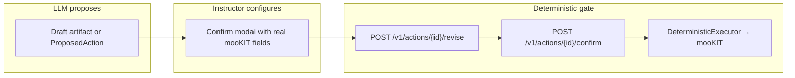
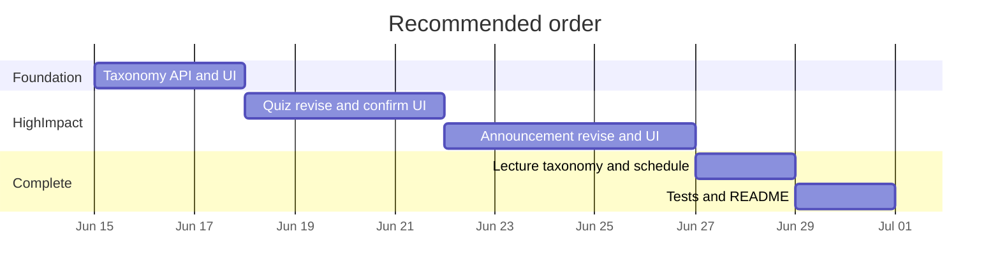

# 11 — Instructor UX: Remove Hardcoded mooKIT Defaults

**Status:** Approved product direction (June 2026)  
**Scope:** Create-only assistant flows — no browse/edit of existing mooKIT content  
**Related:** [09-mookit-api-reference.md](09-mookit-api-reference.md), [04-modules-and-ux.md](04-modules-and-ux.md)

---

## Product north star (locked decisions)

| Decision | Implication |
|----------|-------------|
| **Quiz publish** | Configure dates/settings in confirm modal, then publish with those values |
| **Taxonomy** | Dropdowns from live `GET /taxonomies/{type}` — not hardcoded Week 1–16 |
| **Announcements** | Explicit: audience picker, email toggle, schedule, attachments |
| **Scope** | Create-only — no list/browse/update of existing mooKIT content |

**Out of scope:** browse/edit existing quizzes/announcements/lectures, full exam/SEB flow, Zoom integration, urgent-type toggle (can stay AI-inferred unless added later).

---

## Architecture (unchanged security model)



The executor never reads LLM text at confirm time — only the stored `pending_actions.payload` after revise. Preview must reflect payload exactly.

---

## Gap analysis: what we fix today

| Area | Today (hidden / hardcoded) | Target (instructor-visible) |
|------|---------------------------|----------------------------|
| Quiz dates | `now` → `+7 days` in `_default_assessment_create()` | Confirm modal: start / end / results |
| Quiz type | Always `quizzes` | Select quiz / exam / assignment |
| Quiz flags | `timed=0`, `retake=0`, etc. silent | Optional toggles in confirm modal |
| Announcement audience | Text label → server resolve only | Section dropdown from taxonomy |
| Email / schedule | Inferred / always `published.status=1` now | Explicit toggles + datetime |
| Attachments | Never (`fileIds` unset) | Upload → mooKIT file IDs |
| Lecture week | UI hardcoded Week 1–16 | Dropdown from `/taxonomies/week` |
| Lecture module | `topicId=0` when unset | Optional module dropdown |
| Urgent announcement type | AI-inferred from intent | Keep inferred (optional toggle later) |

### Key code locations (current defaults)

- Quiz assessment body: `app/tools/assessment.py` → `_default_assessment_create()`
- Quiz publish executor: `app/core/executor.py` → `_publish_assessment()`
- Announcement payload: `app/tools/announcement.py` → `SendAnnouncementTool`
- Announcement audience: `app/core/executor.py` → `_resolve_audience()`
- Lecture taxonomy: `app/gen/lecture_meta.py`, `app/tools/lecture.py` (`topicId or 0`)
- UI week picker: `sample-ui/index.html` → `initWeekPicker()` (Week 1–16)
- Announcement revise (partial): `app/core/confirmation.py`, `app/api/confirm.py`

---

## Phase 1 — Live course taxonomy (foundation)

Everything else depends on real week/module/section IDs from mooKIT.

### 1.1 Backend: taxonomy read API

**New file:** `app/api/taxonomy.py`

```
GET /v1/taxonomy/{type}     # type ∈ week | module | topic | section
GET /v1/taxonomy            # optional batch: { week, module, section, topic }
```

- Calls `MooKitClient.list_taxonomy(ctx, type)` (`app/mookit/client.py`)
- Same auth headers as chat (`course`, `token`, `uid`)
- Response: `{ "type": "week", "terms": [{ "id": 104, "name": "Week 4" }] }`
- Redis cache: `{tenant_key}:taxonomy:{type}`, TTL 300s (match permissions cache)
- Register in `app/main.py`

### 1.2 Extend `GET /v1/meta`

In `app/api/meta.py`, add `taxonomyAvailable: bool` when permissions loaded successfully.

### 1.3 UI: replace hardcoded pickers

In `sample-ui/index.html`:

| Location | Change |
|----------|--------|
| `initWeekPicker()` | Delete Week 1–16 loop; populate from `/v1/taxonomy/week` |
| Add `#lecture-module` | Optional module dropdown from `/v1/taxonomy/module` |
| `loadTaxonomy()` | Called on init + when token/course changes (with `loadMeta()`) |
| `offerLectureActions()` | Use selected term name + resolved id |
| Empty / 403 | Disable lecture publish; show permission/help banner |

### 1.4 Tests

- `tests/api/test_taxonomy.py` — mock mooKIT, verify shape and caching

---

## Phase 2 — Quiz settings in publish confirm modal

### 2.1 Seed editable defaults in publish tool

In `PublishAssessmentTool` (`app/tools/assessment.py`):

- Keep `_default_assessment_create()` as initial `payload["assessment"]`
- Extend `build_assessment_preview()` (`app/preview/render.py`) with human-readable date lines in `summary_lines`

### 2.2 Confirmation gate: `revise_assessment`

**New method:** `ConfirmationGate.revise_assessment(action_id, tenant_key, **fields)`

Writable fields (→ `payload["assessment"]` + `payload["_type"]`):

| Field | UI control |
|-------|------------|
| `_type` | quizzes / exams / assignments |
| `startDate`, `endDate`, `endDapDate`, `resultsDate` | datetime → unix |
| `timed`, `duration` | checkbox + minutes (duration required if timed) |
| `instructions` | optional textarea |
| `showCorrectAnswers`, `retakeAllowed` | checkboxes |

Validation: `endDate >= startDate`, `resultsDate >= endDate`. Recompute `content_hash` + update preview.

Do **not** mutate `questions[]` here (use draft card / `POST /v1/quiz/{id}/edit`).

### 2.3 API: extend revise endpoint

In `app/api/confirm.py`, dispatch `POST /v1/actions/{id}/revise` by pending action type:

```python
class ReviseAssessmentBody(BaseModel):
    assessment_type: Literal["quizzes", "exams", "assignments"]
    start_date: int
    end_date: int
    end_dap_date: int
    results_date: int
    timed: int = 0
    duration: int | None = None
    instructions: str | None = None
    show_correct_answers: int = 0
    retake_allowed: int = 0
```

### 2.4 UI: publish_assessment confirm panel

Extend `showConfirm()` in `sample-ui/index.html`:

- Type select, 3 datetime fields, timed/duration, instructions, optional flags
- On confirm: `POST revise` → `POST confirm`
- Keep diagram attach summary (existing)

### 2.5 Executor

No logic change — already reads `payload["assessment"]` and `_type`. Ensure revise writes camelCase keys matching `AssessmentCreate` (`app/mookit/schemas.py`).

### 2.6 Tests

- `tests/core/test_confirmation_revise_assessment.py`
- Executor test: published assessment uses revised dates from stored payload

---

## Phase 3 — Announcement controls in confirm modal

Partially done: editable subject/body + `revise_announcement`.

### 3.1 Extend `revise_announcement`

| UI | Payload |
|----|---------|
| Audience: “All students” or section | `_audience_intent` + `sectionIds` (resolve at revise time, same logic as `_resolve_audience`) |
| Email checkbox | `notifyMail` 0/1 |
| Schedule + datetime | `published: { status, releaseOn }` — future → `status: 0` until release |
| Attachment list | `fileIds: [int, ...]` |

**Urgent (`type`):** keep from draft payload (AI-inferred).

### 3.2 Attachment staging

**New endpoint** in `app/api/announcement.py`:

```
POST /v1/announcement/attach
  multipart file → upload to mooKIT /files/add (verify entityId=0 on test instance)
  → { fileId, filename }
```

### 3.3 Extend revise body

```python
class ReviseAnnouncementBody(BaseModel):
    title: str
    description: str
    audience: Literal["all"] | int          # section taxonomy id
    notify_mail: int
    schedule_at: int | None = None          # None = send now
    file_ids: list[int] = []
```

Executor: re-validate audience (fail-closed); apply `published` from payload.

### 3.4 UI

Extend announcement confirm modal:

- Audience `<select>` from `/v1/taxonomy/section` + “All students”
- “Also send email” checkbox
- “Schedule for later” + datetime
- File attach + removable list

Mirror on announcement draft card where practical.

### 3.5 Tests

- Scheduled announcement: `published.status=0`, `releaseOn` set
- Section audience: `sectionIds` in payload, hash valid
- Bad section id at revise → 400 with available sections

---

## Phase 4 — Lecture alignment with taxonomy

### 4.1 Draft / quick actions

- Pass `week_id` / `topic_id` from UI into `DraftLectureArgs` (`app/tools/lecture.py`)
- Optional: `POST /v1/lecture/{draft_id}/edit`

### 4.2 Confirm modal (`publish_lecture`)

- Show resolved week/module labels from taxonomy
- Optional schedule: `releaseOn` + `published`

---

## Phase 5 — Polish and adoption

- Confirm modals: “This is exactly what will be created on mooKIT”
- Empty taxonomy: “No weeks in this course — configure in mooKIT first”
- Optional: `GET /files/allowed_extensions` in meta for upload `accept=`
- Update `README.md` manual test checklist

---

## Build sequence



1. Taxonomy API + UI dropdowns  
2. Quiz confirm settings + revise  
3. Announcement audience / email / schedule / attachments  
4. Lecture taxonomy + optional schedule  
5. Tests + manual QA on live mooKIT course  

---

## Files to touch

| File | Phases |
|------|--------|
| `app/api/taxonomy.py` **new** | 1 |
| `app/api/meta.py` | 1 |
| `app/main.py` | 1 |
| `sample-ui/index.html` | 1–4 |
| `app/core/confirmation.py` | 2–3 |
| `app/api/confirm.py` | 2–3 |
| `app/preview/render.py` | 2–3 |
| `app/tools/assessment.py` | 2 |
| `app/api/announcement.py` | 3 |
| `app/tools/lecture.py` | 4 |
| New tests under `tests/api/`, `tests/core/` | 1–3 |
| `README.md` | 5 |

---

## Manual test playbook

1. Valid JWT + course → meta shows permissions; taxonomy dropdowns populate  
2. Upload PDF → quiz draft → publish confirm → set end date 2 weeks out → confirm → verify on mooKIT  
3. Draft announcement → confirm → one section, email on, schedule tomorrow, attach file → confirm  
4. Upload video → pick real week from dropdown → publish lecture → verify `weekId` on mooKIT  

---

## Risks and mitigations

| Risk | Mitigation |
|------|------------|
| mooKIT 403 on permissions/taxonomy | Disable publish controls; banner in UI |
| Attachments without announcement entity | Verify `/files/add` with `entityId=0` on test instance |
| Timezone confusion in datetime pickers | Label as local time or show UTC in modal |
| Hash mismatch after revise | Gate always recomputes hash; follow confirm harness tests |
| Scope creep | No list/browse tools; create-only copy in UI |

---

## Open item (optional)

**Urgent vs normal** for announcements: currently AI-inferred from intent. Add explicit Normal / Urgent toggle in Phase 3 if instructors mis-send as normal.

---

## Implementation checklist

- [x] Phase 1: `GET /v1/taxonomy` + UI dropdowns  
- [x] Phase 2: `revise_assessment` + quiz confirm modal  
- [x] Phase 3: extended `revise_announcement` + attach API + announcement confirm UI  
- [x] Phase 4: lecture taxonomy ids + schedule in confirm (incl. `POST /v1/lecture/{id}/edit`)  
- [x] Phase 5: tests + README + automated QA (manual QA on `test.mookit.in` pending tokens)  
